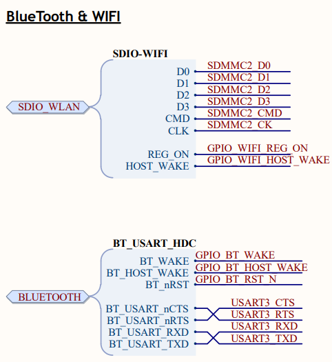

# artpi
Experience with the STM32H7, Uboot and the Linux kernel on the ART-Pi board 


# Why
The board was developed by the
https://www.rt-thread.org/

It has kernel and u-boot support. Here is how to build.

https://github.com/RT-Thread-Studio/sdk-bsp-stm32h750-realthread-artpi/tree/master/projects/art_pi_kboot


# Devices

8MiB QSPI flash (Boot flash)
16MiB SPI flash (W25Q64)              ORIGIN =0x90000000,LENGTH =8192k
32MiB SDRAM
AP6212 wifi,bt,fm comb


https://github.com/RT-Thread-Studio/sdk-bsp-stm32h750-realthread-artpi


Most of the examples use the following adress mapping,
```

norflash0 | addr: 0x00000000 | len: 0x01000000 | blk_size: 0x00001000 |initialized finish.
norflash1 | addr: 0x00000000 | len: 0x00800000 | blk_size: 0x00001000 |initialized finish.

[I/FAL] ==================== FAL partition table ====================
[I/FAL] | name       | flash_dev |   offset   |    length  |
[I/FAL] -------------------------------------------------------------
[I/FAL] | wifi_image | norflash0 | 0x00000000 | 0x00080000 |
[I/FAL] | bt_image   | norflash0 | 0x00080000 | 0x00080000 |
[I/FAL] | download   | norflash0 | 0x00100000 | 0x00200000 |
[I/FAL] | easyflash  | norflash0 | 0x00300000 | 0x00100000 |
[I/FAL] | filesystem | norflash0 | 0x00400000 | 0x00a00000 |
[I/FAL] | factory    | norflash0 | 0x00e00000 | 0x00200000 |
[I/FAL] | app        | norflash1 | 0x00000000 | 0x00800000 |


Linker,
https://stackoverflow.com/questions/51323589/are-all-ram-sections-used-in-this-linkerscript-of-a-stm32h743-microcontroller-c


From this mapping

ROM (rx) : ORIGIN =0x90000000,LENGTH =8192k
RAM (rw) : ORIGIN =0x24000000,LENGTH =512k
RxDecripSection (rw) : ORIGIN =0x30040000,LENGTH =32k
TxDecripSection (rw) : ORIGIN =0x30040060,LENGTH =32k
RxArraySection (rw) : ORIGIN =0x30040200,LENGTH =32k
ROM (rx)    : ORIGIN =0x08000000,LENGTH =8192k

To this to run in qemu

QFLASH (rx) : ORIGIN =0x90000000,LENGTH =8192k
RAM (rw)    : ORIGIN =0x24000000,LENGTH =512k
ROM (rx) : ORIGIN =0x08000000,LENGTH =128k
RAM (rw) : ORIGIN =0x24000000,LENGTH =512k


```


AP6212 is a low-power and high-performance WiFi+BT4.2 module launched by AMPAK. This module conforms to 802.11b/g/n. The WiFi function adopts SDIO interface, and the Bluetooth adopts UART/I2S/PCM interface, with StationMode, SoftAP, P2P function, etc. The hardware circuit connection of the chip is shown in the figure.


(Broadcom BCM43438 A1 chip inside)  https://blog.quarkslab.com/reverse-engineering-broadcom-wireless-chipsets.html


# Linux for the st32m_h8
One of the few MMU-less arm boards supported in the kernel source tree

You can learn more about 
https://linux-kernel-labs.github.io/refs/heads/master/so2/lab11-arm-kernel-development.html


sw context:
- as stm32h750 just has 128k bytes internal flash, so running a fw on
  internal flash to download u-boot/kernel to qspi flash, boot
  u-boot/kernel from qspi flash. this fw is based on rt-thread.
- kernel can be xip on qspi flash or load to sdram
- root filesystem is jffs2(created by buildroot), stored on spi flash


to support the boad, add following changes.
- fix r0-r3, r12 register restore failed after svc call,
- add dts binding
- update yaml doc


## Build procedure

On an ubuntu LTS system

   apt install git make gcc device-tree-compiler bison flex libssl-dev libncurses-dev python3-ply python3-git libgmp3-dev libmpc-dev

   sudo apt-get install libc6-armel-cross gcc-arm-linux-gnueabi libc6-dev-armel-cross binutils-arm-linux-gnueabi libncurses5-dev build-essential bison flex libssl-dev bc

   sudo apt install gdb-multiarch

## U-boot

   git clone https://github.com/u-boot/u-boot

   ARCH=arm CROSS_COMPILE=arm-linux-gnueabi- make stm32h750-art-pi_defconfig

   ARCH=arm CROSS_COMPILE=arm-linux-gnueabi- make 


   ../qemu-7.0.0-rc4/build/arm-softmmu/qemu-system-arm -M artpi -cpu cortex-m7 -d 'in_asm,int,exec,cpu,guest_errors,unimp' -m 32M  -bios ../artpi/libraries/qemu/bootloader.bin -nographic  -s -S

### N/A
$ sudo apt-get install gcc-arm-linux-gnueabihf g++-arm-linux-gnueabihf # for arm32
$ sudo apt-get install gcc-aarch64-linux-gnu g++-aarch64-linux-gnu     # for arm64


### Optional is to install Linaro arm cross compiler
   Optional

   wget http://releases.linaro.org/components/toolchain/gcc-linaro/7.5-2019.12/gcc-linaro-7.5-2019.12.tar.xz
   sudo tar xf gcc-linaro-7.3.1-2018.05-x86_64_arm-linux-gnueabihf.tar.xz -C /opt

   git clone https://git.kernel.org/pub/scm/linux/kernel/git/torvalds/linux.git

   sudo tar xf gcc-linaro-7.5-2019.12.tar.xz -C /opt


### Get kernel and compile

   git clone https://git.kernel.org/pub/scm/linux/kernel/git/torvalds/linux.git

Or get latest version 

   wget ttps://git.kernel.org/pub/scm/linux/kernel/git/torvalds/linux.git/tag/?h=v5.18-rc4


    
# compile the kernel


    cd linux
    export ARCH=arm
    export CROSS_COMPILE=arm-linux-gnueabi-

    make stm32_defconfig
      then
    make menuconfig
      Add debug configuration and remove MMU support

    make
    make dtbs

    ls arch/arm/boot/dts/stm32h750*

    ARCH=arm CROSS_COMPILE=arm-linux-gnueabi- make -j8
    ARCH=arm CROSS_COMPILE=arm-linux-gnueabi- make -j8
    file vmlinux
    vmlinux: ELF 32-bit LSB executable, ARM, EABI5 version 1 (SYSV), statically linked, BuildID[sha1]=304e52462758033e520112825260e36c8589e18b, with debug_info, not stripped


# Run qemu

   You need qemu 7 with patches to emulate the artpi board

   qemu-img create -f raw sd.bin 64M
   if [ ! -f "sd.bin" ]; then
     dd if=/dev/zero of=sd.bin bs=1024 count=65536
   fi

   qemu-system-arm -M artpi -kernel rtthread.elf -serial stdio -sd sd.bin -S -s


   Get a minimal qemu-arm filesystem


   wget http://downloads.yoctoproject.org/releases/yocto/yocto-2.5/machines/qemu/qemuarm/core-image-minimal-qemuarm.ext4


    Start qemu 

    ../qemu-7.0.0-rc4/build/arm-softmmu/qemu-system-arm -M artpi -cpu cortex-m7 -d 'in_asm,int,exec,cpu,guest_errors,unimp' -m 32M -kernel arch/arm/boot/zImage -nographic  -dtb arch/arm/boot/dts/stm32h750i-art-pi.dtb  -append "root=/dev/mmcblk0 rw console=ttymxc0 loglevel=8 earlycon printk" -serial stdio -sd core-image-minimal-qemuarm.ext4 -S


    Start debugger in other window
    file vmlinux


    killall -9 qemu-system-arm
   
    gdb-multiarch vmlinux
    (gdb) set arch arm
    (gdb) target remote:1234


Note that qemu does not use the device tree to create all devices, it just passes the device tree to the kernel


### Kernel tree art-pi highlights

    Documentation/arm/stm32/stm32h750-overview.rst
    Documentation/arm/index.rst                        |   1 +
    Documentation/arm/stm32/stm32h750-overview.rst     |  33 ++
    .../devicetree/bindings/arm/stm32/stm32.yaml       |   4 +
    .../bindings/pinctrl/st,stm32-pinctrl.yaml         |   1 +
    arch/arm/boot/dts/Makefile                         |   1 +
    arch/arm/boot/dts/stm32h7-pinctrl.dtsi             | 392 +++++++++++++++++++++
    arch/arm/boot/dts/stm32h743-pinctrl.dtsi           | 307 +---------------
    arch/arm/boot/dts/stm32h743.dtsi                   |  30 ++
    arch/arm/boot/dts/stm32h750-pinctrl.dtsi           |  11 +
    arch/arm/boot/dts/stm32h750.dtsi                   |   5 +
    arch/arm/boot/dts/stm32h750i-art-pi.dts            | 228 ++++++++++++
    arch/arm/mach-stm32/board-dt.c                     |   1 +
    drivers/pinctrl/stm32/Kconfig                      |   2 +-
    drivers/pinctrl/stm32/pinctrl-stm32h743.c          |   3 +
    Documentation/arm/stm32/stm32h750-overview.rst
    arch/arm/boot/dts/stm32h7-pinctrl.dtsi
    arch/arm/boot/dts/stm32h750-pinctrl.dtsi
    arch/arm/boot/dts/stm32h750.dtsi
    arch/arm/boot/dts/stm32h750i-art-pi.dts


###  Other

https://medium.com/@jan_75582/setup-arm-web-application-development-environment-with-qemu-for-stm32-500f5650a489


https://www.kernel.org/doc/Documentation/filesystems/ramfs-rootfs-initramfs.txt

I do suggest that you try to include your rootfs in the zImage because you do not need to point to the disk, just the init. qemu-system-arm -M versatileab -m 128M -kernel zImage -append "rdinit=/bin/sh" (I think, its been a couple of months) – 
look at the section "What is initramfs?" here for information, but note that I had to point my kernel to the _install directory from busybox NOT the cpio file I created as instructed here. This is more of a what is the difference between ramDisk and initramfs than a correct how to. Here is another one


### Arm kernel options
https://www.kernel.org/doc/html/latest/arm/index.html

# Links

https://balau82.wordpress.com/2010/04/12/booting-linux-with-u-boot-on-qemu-arm/

# Bare metal projects
https://github.com/chcbaram/ART-Pi

https://wiki.st.com/stm32mpu/wiki/Debugging_the_Linux_kernel_using_the_GDB


https://www.emcraft.com/stm32f769i-discovery-board/installing-uboot-to-stm32f7-discovery-board


ART-Pi setup guide.
https://www.programmersought.com/article/60736526194/

QSPI support
https://wiki.segger.com/STM32H7#STM32H753xx.2F50xx.2F43xx_QSPI_support


# Somewhat related

https://hackaday.com/2021/05/19/raspberry-pi-rp2040-hands-on-experiences-from-an-stm32-perspective/

Cross compile
https://jensd.be/1126/linux/cross-compiling-for-arm-or-aarch64-on-debian-or-ubuntu

Interesting crazyflie
https://lup.lub.lu.se/luur/download?func=downloadFile&recordOId=9052405&fileOId=9052409

Gfx lib
https://support.touchgfx.com/4.19/docs/introduction/welcome

More qemu
https://www.youtube.com/watch?v=CdH-cad8DSw

Trusted platfom mode with qemu
https://www.linaro.org/blog/how-to-emulate-trusted-platform-module-in-qemu-with-u-boot/

Qemu for stm32
https://medium.com/@jan_75582/setup-arm-web-application-development-environment-with-qemu-for-stm32-500f5650a489


# qemu options
Not all are needed here, but is saved for reference

    -smp cores=4 -m 1024 -device sdhci-pci -device sd-card,drive=mydrive -drive id=mydrive,if=none,format=raw,file=image.bin


    -drive file=flash_image.bin,if=mtd,format=raw

    -global driver=timer.esp32.timg,property=wdt_disable,value=true

    -drive file=sd_image.bin,if=sd,format=raw


# Jump to built in bootloader on h7

In STM32H7, the base address of system memory is different from the entry point of the bootloader. 

Thus, in order to jump to the bootloader, address "0x1FF09800" should be used instead of "0x1FFF0000". 

Below, you find a sample code permitting the jump to the bootloader in STM32H7 devices:

```
void JumpToBootloader(void)
{
  uint32_t i=0;
  void (*SysMemBootJump)(void);
 
  /* Set the address of the entry point to bootloader */
     volatile uint32_t BootAddr = 0x1FF09800;
 
  /* Disable all interrupts */
     __disable_irq();

  /* Disable Systick timer */
     SysTick->CTRL = 0;
	 
  /* Set the clock to the default state */
     HAL_RCC_DeInit();

  /* Clear Interrupt Enable Register & Interrupt Pending Register */
     for (i=0;i<5;i++)
     {
	  NVIC->ICER[i]=0xFFFFFFFF;
	  NVIC->ICPR[i]=0xFFFFFFFF;
     }	
	 
  /* Re-enable all interrupts */
     __enable_irq();
	
  /* Set up the jump to booloader address + 4 */
     SysMemBootJump = (void (*)(void)) (*((uint32_t *) ((BootAddr + 4))));
 
  /* Set the main stack pointer to the bootloader stack */
     __set_MSP(*(uint32_t *)BootAddr);
 
  /* Call the function to jump to bootloader location */
     SysMemBootJump(); 
  
  /* Jump is done successfully */
     while (1)
     {
      /* Code should never reach this loop */
     }
}

```


gdb-multiarch u-boot -ex 'target remote:1234'

(gdb) s $pc=0x90000f46+1

Possibility to run in qemu.
https://github.com/RT-Thread-Studio/sdk-bsp-stm32h750-realthread-artpi/commit/244051251dddd944cccfa478a84e67e812cfbc6b

nvalid read at addr 0x9003EAE4, size 4, region '(null)', reason: rejected
Invalid read at addr 0xFFFFFFFC, size 4, region '(null)', reason: rejected
Invalid read at addr 0xFFFFFFFC, size 4, region '(null)', reason: rejected
Invalid read at addr 0xFFFFFFFE, size 2, region '(null)', reason: rejected
Invalid read at addr 0xFFFFFFFC, size 2, region '(null)', reason: rejected
Invalid read at addr 0xFFFFFFFE, size 2, region '(null)', reason: rejected
Invalid read at addr 0xFFFFFFFC, size 2, region '(null)', reason: rejected
Invalid read at addr 0xFFFFFFFC, size 4, region '(null)', reason: rejected
Invalid read at addr 0xFFFFFFFC, size 4, region '(null)', reason: rejected
Invalid read at addr 0x90000F46, size 2, region '(null)', reason: rejected
Invalid read at addr 0x90000F48, size 2, region '(null)', reason: rejected
Invalid read at addr 0x90000F42, size 2, region '(null)', reason: rejected
Invalid read at addr 0x90000F44, size 2, region '(null)', reason: rejected
Invalid read at addr 0x90000F46, size 2, region '(null)', reason: rejected
Invalid read at addr 0x90000F48, size 2, region '(null)', reason: rejected
Invalid read at addr 0x90000F42, size 2, region '(null)', reason: rejected
Invalid read at addr 0x90000F44, size 2, region '(null)', reason: rejected
Invalid read at addr 0x90000F46, size 2, region '(null)', reason: rejected
Invalid read at addr 0x90000F44, size 2, region '(null)', reason: rejected
Invalid read at addr 0x90000F42, size 2, region '(null)', reason: rejected
Invalid read at addr 0x90000F46, size 2, region '(null)', reason: rejected
Invalid read at addr 0x90000F44, size 2, region '(null)', reason: rejected
Invalid read at addr 0x90000F42, size 2, region '(null)', reason: rejected
Invalid read at addr 0x90000F46, size 2, region '(null)', reason: rejected
Invalid read at addr 0x90000F48, size 2, region '(null)', reason: rejected
Invalid read at addr 0x90000F42, size 2, region '(null)', reason: rejected
Invalid read at addr 0x90000F44, size 2, region '(null)', reason: rejected
Invalid read at addr 0x90000F46, size 2, region '(null)', reason: rejected
Invalid read at addr 0x90000F48, size 2, region '(null)', reason: rejected
Invalid read at addr 0x90000F42, size 2, region '(null)', reason: rejected
Invalid read at addr 0x90000F44, size 2, region '(null)', reason: rejected
Invalid read at addr 0x90000F46, size 2, region '(null)', reason: rejected
Invalid read at addr 0x90000F48, size 2, region '(null)', reason: rejected
Invalid read at addr 0x90000F46, size 2, region '(null)', reason: rejected
Invalid read at addr 0x90000F48, size 2, region '(null)', reason: rejected
Invalid read at addr 0x90000F46, size 2, region '(null)', reason: rejected
Invalid read at addr 0x90000F48, size 2, region '(null)', reason: rejected
Invalid read at addr 0xFFFFFFFE, size 2, region '(null)', reason: rejected
Invalid read at addr 0xFFFFFFFA, size 2, region '(null)', reason: rejected
Invalid read at addr 0xFFFFFFFC, size 2, region '(null)', reason: rejected
Invalid read at addr 0xFFFFFFFE, size 2, region '(null)', reason: rejected
Invalid read at addr 0xFFFFFFFA, size 2, region '(null)', reason: rejected
Invalid read at addr 0xFFFFFFFC, size 2, region '(null)', reason: rejected
Invalid read at addr 0xFFFFFFFE, size 2, region '(null)', reason: rejected
Invalid read at addr 0xFFFFFFFC, size 2, region '(null)', reason: rejected
Invalid read at addr 0xFFFFFFFA, size 2, region '(null)', reason: rejected
Invalid read at addr 0xFFFFFFFE, size 2, region '(null)', reason: rejected
Invalid read at addr 0xFFFFFFFC, size 2, region '(null)', reason: rejected
Invalid read at addr 0xFFFFFFFA, size 2, region '(null)', reason: rejected
Invalid read at addr 0xFFFFFFFE, size 2, region '(null)', reason: rejected
Invalid read at addr 0xFFFFFFFA, size 2, region '(null)', reason: rejected
Invalid read at addr 0xFFFFFFFC, size 2, region '(null)', reason: rejected
Invalid read at addr 0xFFFFFFFE, size 2, region '(null)', reason: rejected
Invalid read at addr 0xFFFFFFFA, size 2, region '(null)', reason: rejected
Invalid read at addr 0xFFFFFFFC, size 2, region '(null)', reason: rejected
Invalid read at addr 0xFFFFFFFE, size 2, region '(null)', reason: rejected
Invalid read at addr 0xFFFFFFFE, size 2, region '(null)', reason: rejected
Invalid read at addr 0xFFFFFFFE, size 2, region '(null)', reason: rejected
Invalid read at addr 0xFFFFFFFE, size 2, region '(null)', reason: rejected
Invalid read at addr 0xFFFFFFFA, size 2, region '(null)', reason: rejected
Invalid read at addr 0xFFFFFFFC, size 2, region '(null)', reason: rejected
Invalid read at addr 0xFFFFFFFE, size 2, region '(null)', reason: rejected
Invalid read at addr 0xFFFFFFFA, size 2, region '(null)', reason: rejected
Invalid read at addr 0xFFFFFFFC, size 2, region '(null)', reason: rejected
Invalid read at addr 0xFFFFFFFE, size 2, region '(null)', reason: rejected
Invalid read at addr 0xFFFFFFFC, size 2, region '(null)', reason: rejected
Invalid read at addr 0xFFFFFFFA, size 2, region '(null)', reason: rejected
Invalid read at addr 0xFFFFFFFE, size 2, region '(null)', reason: rejected
Invalid read at addr 0xFFFFFFFC, size 2, region '(null)', reason: rejected
Invalid read at addr 0xFFFFFFFA, size 2, region '(null)', reason: rejected
Invalid read at addr 0xFFFFFFFE, size 2, region '(null)', reason: rejected
Invalid read at addr 0xFFFFFFFA, size 2, region '(null)', reason: rejected
Invalid read at addr 0xFFFFFFFC, size 2, region '(null)', reason: rejected
Invalid read at addr 0xFFFFFFFE, size 2, region '(null)', reason: rejected
Invalid read at addr 0xFFFFFFFA, size 2, region '(null)', reason: rejected
Invalid read at addr 0xFFFFFFFC, size 2, region '(null)', reason: rejected
Invalid read at addr 0xFFFFFFFE, size 2, region '(null)', reason: rejected
Invalid read at addr 0xFFFFFFFE, size 2, region '(null)', reason: rejected
Invalid read at addr 0xFFFFFFFE, size 2, region '(null)', reason: rejected


