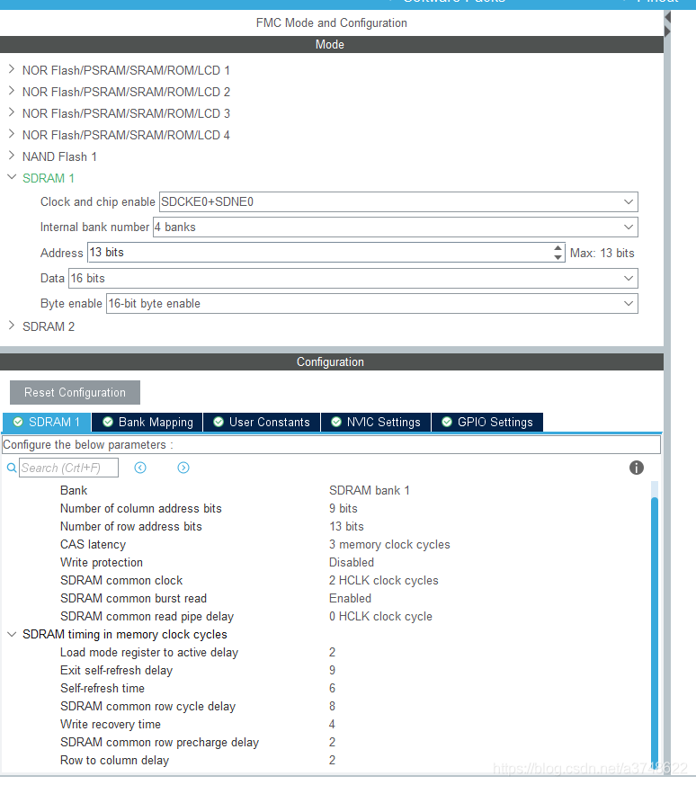

# artpi
Experience with the STM32H7, Uboot and the Linux kernel on the ART-Pi board 


# Why
The board was developed by the
https://www.rt-thread.org/

It has kernel and u-boot support. Here is how it works.

https://github.com/RT-Thread-Studio/sdk-bsp-stm32h750-realthread-artpi/tree/master/projects/art_pi_kboot

To understand better the ry command, you must look in the art_pi_kboot project:
 Most significantly here, projects/art_pi_kboot/applications/main.c
 The command ry is added to MSH that uploads binaries with YMODEM.
 
I have modified the original project to be able to run without RT-Thread
and instead run as far as possible with qemu. The patches in the qemu folder relies on qemu 7.0

   > gdb u-boot -ex 'target remote:1234'

This is a great oportunity to learn more about arm, the stm32h7, uboot, Ghidra, qemu and arm Linux kernel without MMU support.


   "bootargs=console=ttySTM0,2000000 root=/dev/ram loglevel=8"

   Note from the device tree,
   aliases {
		serial0 = &uart4;
		serial1 = &usart3;
	};

So far with this qemu it hangs here common/board_f.c
     if (initcall_run_list(init_sequence_f)) 
       hang(); 

## Errata
 When starting a project with STM32CubeMX and want to use external RAM,
 
You must change the FMC settings to use the external RAM.
Also you must call SDRAM_Initialization_Sequence
projects\art_pi_gdbstub\board\drv_sdram.c
## Arm simulator

To fiddle with simple arm programs, 

https://cpulator.01xz.net/?sys=arm


## Precautions for the artpi

- Debug serial port to serial port 4 mapping instructions

    PI9 ------> USART4_RX

    PA0 ------> USART4_TX


   On the art-pi board uart4 is connected to the Stlink

## Some notes from running u-boot

```
When looking at the sources and reverse engineering the u-boot binary in
/projects/art_pi_kboot/demo
It seems like the Device tree blob should be located at,
   fdt_blob = 0x9004_0044

Other boot-time parameters,

   kernel_addr_r=0xC000_8000
   fdtfile=stm32h750i-art-pi.dtb
   fdt_addr_r=0xC0408000
   scriptaddr=0xC0418000
   pxefile_addr_r=0xC0428000
   ramdisk_addr_r=0xC0438000
   boot_scripts=boot.scr.uimg boot.scr

global_data is a structure used by u-boot.
   struct global_data *gd_ptr;
   r9 + 0x70


   (gdb) p *gd_ptr             
    $13 = {bd = 0x0, flags = 0, baudrate = 0, cpu_clk = 0, bus_clk = 0, pci_clk = 0, mem_clk = 0, have_console = 0,
    env_addr = 0,	env_valid = 0, env_has_init = 0, env_load_prio = 0, ram_base = 0, ram_top = 0, relocaddr = 0,
    ram_size = 0,	mon_len = 241896, irq_sp = 0, start_addr_sp = 0, reloc_off = 0,	new_gd = 0x0, dm_root = 0x0,
    dm_root_f = 0x0, uclass_root_s = {next = 0x0,	prev = 0x0}, uclass_root = 0x0,	timer = 0x0, 
    fdt_blob = 0x90040044, new_fdt = 0x0,	fdt_size = 0, fdt_src = FDTSRC_SEPARATE, jt = 0x0,
    env_buf = '\000' * 31 , timebase_h = 0, timebase_l = 0, malloc_base = 604238080,	malloc_limit = 0,
    malloc_ptr = 0, cur_serial_dev = 0x0, arch = {timer_rate_hz = 0, tbu = 0, tbl = 0, lastinc = 0,
     timer_reset_value = 0, tlb_addr = 0, tlb_size = 0}, dmtag_list = {next = 0x0, prev = 0x0}}

 p/x *gd
$9 = {bd = 0x0, flags = 0x0, baudrate = 0x1e8480, cpu_clk = 0x0, bus_clk = 0x0, pci_clk = 0x0, mem_clk = 0x0, have_console = 0x0, env_addr = 0x9002a004, env_valid = 0x1,
   env_has_init = 0x1000, env_load_prio = 0x0, ram_base = 0x0, ram_top = 0x0, relocaddr = 0x0, ram_size = 0x0, mon_len = 0x39d68, irq_sp = 0x0, start_addr_sp = 0x0, reloc_off = 0x0,
   new_gd = 0x0, dm_root = 0x2403f118, dm_root_f = 0x0, uclass_root_s = {next = 0x2403f110, prev = 0x2403f110}, uclass_root = 0x2403f07c, timer = 0x0, fdt_blob = 0x9003ea7c, 
   new_fdt = 0x0, fdt_size = 0x0, fdt_src = 0x0, jt = 0x0, env_buf = {0x32, 0x30, 0x30, 0x30, 0x30, 0x30, 0x30, 0x0 <repeats 25 times>}, timebase_h = 0x0, timebase_l = 0x0,
   malloc_base = 0x2403f100, malloc_limit = 0xf00, malloc_ptr = 0x6c, cur_serial_dev = 0x0, arch = {timer_rate_hz = 0x0, tbu = 0x0, tbl = 0x0, lastinc = 0x0, timer_reset_value = 0x0,
     tlb_addr = 0x0, tlb_size = 0x0}, dmtag_list = {next = 0x2403f0f8, prev = 0x2403f0f8}}


When using qemu we can load u-boot and kernel

   (gdb) restore org-u-boot binary 0x90000000 0 275089
   (gdb) restore u-boot.bin binary 0x90000000 0 
   (gdb) restore art.itb binary 0x90080000 0 
   (gdb) restore u-boot-dtb.bin binary 0x90040044 0

   > If you compiled u-boot manually
   restore u-boot.bin binary 0x90000000 0
   restore art.itb binary 0x90080000 0
   restore u-boot-dtb.bin binary 0x90040044 0


   (gdb) p/x *0x90000004
   (gdb) s	$pc=0x900003fd


     p init_sequence_f
     $1 =  <setup_mon_len>
      <fdtdec_setup>, 
      <initf_malloc>, 
      <log_init>,  
      <initf_bootstage>, 
      <event_init>, 
      <setup_spl_handoff>,
      <arch_cpu_init>, 
      <mach_cpu_init>, 
      <initf_dm>,
     <board_early_init_f>, 
      <timer_init>,
       <env_init>, 
      <init_baud_rate>,

      /* Runs up to here */
      <serial_init>,       serial_find_console_or_panic

       {driver = 0x90037c5c <_u_boot_list_2_driver_2_serial_stm32>, name = 0x90040604 "serial@40004c00", plat_ = 0x2403fa98, parent_plat_ = 0x0, uclass_plat_ = 0x0, driver_data = 2416144538,    parent = 0x2403f118, priv_ = 0x0, uclass = 0x2403fa2c, uclass_priv_ = 0x0, parent_priv_ = 0x0, uclass_node = {next = 0x2403fa34, prev = 0x2403fa34}, child_head = {next = 0x2403fa78, prev = 0x2403fa78},
  sibling_node = {next = 0x2403f14c, prev = 0x2403f9ec}, flags_ = 66, seq_ = 0, node_ = {np = 0x80c, of_offset = 2060}, dma_offset = 0}

       pinctrl_select_state

    configure_clocks()
      drivers/clk/clk_stm32h7.c

     /* set HPRE (/2) DI clk --> 125MHz */                                                                                          
     clrsetbits_le32(&regs->d1cfgr RCC_D1CFGR_HPRE_MASK,                                                                                                                         
                                RCC_D1CFGR_HPRE_DIV2)                                                                                                                                      
                                                                                                                                                                                           
         /*  select PLL1 as system clock source (sys_ck)*/                                                                                                                               
         clrsetbits_le32(&regs->cfgr, RCC_CFGR_SW_MASK, RCC_CFGR_SW_PLL1);                                                                
      while ((readl(&regs->cfgr) & RCC_CFGR_SW_MASK) != RCC_CFGR_SW_PLL1)
                        ;                                                                                                                                                                  

      s32h7xx_powermgt_read: Unknown offset 0x00000010
      stm32h7xx_powermgt_read: Unknown offset 0x00000010
      stm32h7xx_powermgt_read: Unknown offset 0x00000010
      stm32h7xx_powermgt_read: Unknown offset 0x00000010

                                                                                                                                                                                        │
      /* sdram: use pll1_q as fmc_k clk */
      clrsetbits_le32(&regs->d1ccipr, RCC_D1CCIPR_FMCSRC_MASK,         FMCSRC_PLL1_Q_CK);                                                                                              


      <console_init_f>,
      <display_options>, 
      <display_text_info>, 
      <checkcpu>, 
      <show_board_info>,
      <misc_init_f>,
      <announce_dram_init>, 
      <dram_init>,
      <setup_dest_addr>, 
      <reserve_round_4k>, 
      <arch_reserve_mmu>, 
      <reserve_video>, 
      <reserve_trace>,
      <reserve_uboot>, 
      <reserve_malloc>,
      <reserve_board>, 
      <reserve_global_data>, 
      <reserve_fdt>, 
      <reserve_bootstage>, 
      <reserve_bloblist>,
      <reserve_arch>, 
      <reserve_stacks>, 
      <dram_init_banksize>, 
      <show_dram_config>, 
      <setup_bdinfo>, 
      <display_new_sp>, 
      <reloc_fdt>,
      <reloc_bootstage>, 
      <reloc_bloblist>, 
      <setup_reloc>, 
       <clear_bss>,
```


```
    u-boot Init call sequence

      board_init_f():
         - purpose: set up the machine ready for running board_init_r():
            i.e. SDRAM and serial UART
         - global_data is available
         - stack is in SRAM
         - BSS is not available, so you cannot use global/static variables,
            only stack variables and global_data

         Non-SPL-specific notes:
         - dram_init() is called to set up DRAM. If already done in SPL this
            can do nothing

         SPL-specific notes:
         - you can override the entire board_init_f() function with your own
            version as needed.
         - preloader_console_init() can be called here in extremis
         - should set up SDRAM, and anything needed to make the UART work
         - there is no need to clear BSS, it will be done by crt0.S
         - for specific scenarios on certain architectures an early BSS *can*
         be made available (via CONFIG_SPL_EARLY_BSS by moving the clearing
         of BSS prior to entering board_init_f()) but doing so is discouraged.
         Instead it is strongly recommended to architect any code changes
         or additions such to not depend on the availability of BSS during
         board_init_f() as indicated in other sections of this README to
         maintain compatibility and consistency across the entire code base.
         - must return normally from this function (don't call board_init_r()
            directly)

      Here the BSS is cleared. For SPL, if CONFIG_SPL_STACK_R is defined, then at
      this point the stack and global_data are relocated to below
      CONFIG_SPL_STACK_R_ADDR. For non-SPL, U-Boot is relocated to run at the top of
      memory.


    board_init_r():
      - purpose: main execution, common code
      - global_data is available
      - SDRAM is available
      - BSS is available, all static/global variables can be used
      - execution eventually continues to main_loop()

      Non-SPL-specific notes:
      - U-Boot is relocated to the top of memory and is now running from
         there.

      SPL-specific notes:
      - stack is optionally in SDRAM, if CONFIG_SPL_STACK_R is defined and
         CONFIG_SPL_STACK_R_ADDR points into SDRAM
      - preloader_console_init() can be called here - typically this is
         done by selecting CONFIG_SPL_BOARD_INIT and then supplying a
         spl_board_init() function containing this call
      - loads U-Boot or (in falcon mode) Linux


setup_mon_len()
fdtdec_setup () 
Set breakpoint here to see if OK
fdt_check_header()

/* Should not be weak! */
fdtdec_board_setup()

initf_malloc()
arch_cpu_init()

puts("No serial driver found")
                                                                                               

b puts()

Breakpoint 2, puts (s=0x2403edbc "pinctrl_stm32 pin-controller@58020000: hwspinlock_get_by_index may have failed (-38)\n") at common/console.c:691
0x2403ee5c "pinctrl_stm32 pin-controller@58020000: periph->name = serial@40004c00\n") at common/console.c:691
puts (s=0x2403ec2c "gpio_stm32 gpio@58020000: addr = 0x58020000 bank_name = GPIOA gpio_count = 16 gpio_range = 0xffff\n") at common/console.c:69


clk_get_rate(&clk)

stm32_get_PLL1_rate()
"Can't find clk clk-hsi (-19)") at common/console.c:691

stm32h7xx_powermgt_read: Unknown offset 0x000000e8
stm32h7xx_powermgt_write: Unknown offset 0x000000e8
stm32h7xx_powermgt_read: Unknown offset 0x00000028


                                                                                               
                                                                                               
                                                                                                                                                                                                      { 0x90000000, REGION_1, XN_DIS,  PRIV_RW_USR_RW,  SHARED_WRITE_BUFFERED, REGION_256MB }
           { 0xC0000000, REGION_0, XN_DIS,PRIV_RW_USR_RW,    O_I_WB_RD_WR_ALLOC, REGION_512MB }  


{start_addr = 0x90000000, region_no = 0x1, xn = 0x0, ap = 0x3, mr_attr = 0x1, reg_size = 0x1b}
{start_addr = 0xc0000000, region_no = 0x0, xn = 0x0, ap = 0x3, mr_attr = 0x5, reg_size = 0x1c}

dm_init_and_scan()
```


# Qemu u-boot log 

      U-Boot 2022.04-00992-g9bb99fa958 (May 17 2022 - 08:45:08 +0200)

      Model: RT-Thread STM32H750i-ART-PI board
      DRAM:  stm32_fmc fmc@52004000: can't find syscon device (-2)
      stm32_fmc fmc@52004000: no of banks = 1
      pinctrl_stm32 pin-controller@58020000: periph->name = fmc@52004000
      gpio_stm32 gpio@58020c00: addr = 0x58020c00 bank_name = GPIOD gpio_count = 16 gpio_range = 0xffff
      stm32h7_rcc_clock reset-clock-controller@58024400: clk->id 33
      stm32h7_rcc_clock reset-clock-controller@58024400: clkid=33 gate offset=0xe0 bit_index=3 name=gpiod
      gpio_stm32 gpio@58020c00: clock enabled
      gpio_stm32 gpio@58021000: addr = 0x58021000 bank_name = GPIOE gpio_count = 16 gpio_range = 0xffff
      stm32h7_rcc_clock reset-clock-controller@58024400: clk->id 32
      stm32h7_rcc_clock reset-clock-controller@58024400: clkid=32 gate offset=0xe0 bit_index=4 name=gpioe
      gpio_stm32 gpio@58021000: clock enabled
      gpio_stm32 gpio@58021400: addr = 0x58021400 bank_name = GPIOF gpio_count = 16 gpio_range = 0xffff
      stm32h7_rcc_clock reset-clock-controller@58024400: clk->id 31
      stm32h7_rcc_clock reset-clock-controller@58024400: clkid=31 gate offset=0xe0 bit_index=5 name=gpiof
      gpio_stm32 gpio@58021400: clock enabled
      gpio_stm32 gpio@58021800: addr = 0x58021800 bank_name = GPIOG gpio_count = 16 gpio_range = 0xffff
      stm32h7_rcc_clock reset-clock-controller@58024400: clk->id 30
      stm32h7_rcc_clock reset-clock-controller@58024400: clkid=30 gate offset=0xe0 bit_index=6 name=gpiog
      gpio_stm32 gpio@58021800: clock enabled
      gpio_stm32 gpio@58021c00: addr = 0x58021c00 bank_name = GPIOH gpio_count = 16 gpio_range = 0xffff
      stm32h7_rcc_clock reset-clock-controller@58024400: clk->id 29
      stm32h7_rcc_clock reset-clock-controller@58024400: clkid=29 gate offset=0xe0 bit_index=7 name=gpioh
      gpio_stm32 gpio@58021c00: clock enabled
      gpio_stm32 gpio@58020800: addr = 0x58020800 bank_name = GPIOC gpio_count = 16 gpio_range = 0xffff
      stm32h7_rcc_clock reset-clock-controller@58024400: clk->id 34
      stm32h7_rcc_clock reset-clock-controller@58024400: clkid=34 gate offset=0xe0 bit_index=2 name=gpioc
      gpio_stm32 gpio@58020800: clock enabled
      stm32h7_rcc_clock reset-clock-controller@58024400: clk->id 64
      stm32h7_rcc_clock reset-clock-controller@58024400: clkid=64 gate offset=0xd4 bit_index=12 name=fmc
      stm32h7_rcc_clock reset-clock-controller@58024400: clk->id 45
      stm32h7_rcc_clock reset-clock-controller@58024400: system clock: source = 3 freq = 6250000
      stm32h7_rcc_clock reset-clock-controller@58024400: clk->id=45 gate_offset=0xe8 sysclk=6250000
      stm32h7_rcc_clock reset-clock-controller@58024400: system clock: freq after APB1 prescaler = 6250000
      stm32h7_rcc_clock reset-clock-controller@58024400: clk->id 45
      stm32h7_rcc_clock reset-clock-controller@58024400: clkid=45 gate offset=0xe8 bit_index=3 name=tim5
      stm32h7_rcc_clock reset-clock-controller@58024400: system clock: source = 3 freq = 6250000
      stm32h7_rcc_clock reset-clock-controller@58024400: clk->id=45 gate_offset=0xe8 sysclk=6250000
      stm32h7_rcc_clock reset-clock-controller@58024400: system clock: freq after APB1 prescaler = 6250000
      32 MiB
      stm32-rcc reset-clock-controller@58024400: RCC bind
      pinctrl_stm32 pin-controller@58020000: bind gpio@58020000
      pinctrl_stm32 pin-controller@58020000: bind gpio@58020000
      pinctrl_stm32 pin-controller@58020000: bind gpio@58020400
      pinctrl_stm32 pin-controller@58020000: bind gpio@58020400
      pinctrl_stm32 pin-controller@58020000: bind gpio@58020800
      pinctrl_stm32 pin-controller@58020000: bind gpio@58020800
      pinctrl_stm32 pin-controller@58020000: bind gpio@58020c00
      pinctrl_stm32 pin-controller@58020000: bind gpio@58020c00
      pinctrl_stm32 pin-controller@58020000: bind gpio@58021000
      pinctrl_stm32 pin-controller@58020000: bind gpio@58021000
      pinctrl_stm32 pin-controller@58020000: bind gpio@58021400
      pinctrl_stm32 pin-controller@58020000: bind gpio@58021400
      pinctrl_stm32 pin-controller@58020000: bind gpio@58021800
      pinctrl_stm32 pin-controller@58020000: bind gpio@58021800
      pinctrl_stm32 pin-controller@58020000: bind gpio@58021c00
      pinctrl_stm32 pin-controller@58020000: bind gpio@58021c00
      pinctrl_stm32 pin-controller@58020000: bind gpio@58022000
      pinctrl_stm32 pin-controller@58020000: bind gpio@58022000
      pinctrl_stm32 pin-controller@58020000: bind gpio@58022400
      pinctrl_stm32 pin-controller@58020000: bind gpio@58022400
      pinctrl_stm32 pin-controller@58020000: bind gpio@58022800
      pinctrl_stm32 pin-controller@58020000: bind gpio@58022800
      pinctrl_stm32 pin-controller@58020000: bind i2c1-0
      pinctrl_stm32 pin-controller@58020000: bind rmii-0
      pinctrl_stm32 pin-controller@58020000: bind sdmmc1-b4-0
      pinctrl_stm32 pin-controller@58020000: bind sdmmc1-b4-od-0
      pinctrl_stm32 pin-controller@58020000: bind sdmmc1-b4-sleep-0
      pinctrl_stm32 pin-controller@58020000: bind sdmmc1-dir-0
      pinctrl_stm32 pin-controller@58020000: bind sdmmc1-dir-sleep-0
      pinctrl_stm32 pin-controller@58020000: bind sdmmc2-b4-0
      pinctrl_stm32 pin-controller@58020000: bind sdmmc2-b4-od-0
      pinctrl_stm32 pin-controller@58020000: bind sdmmc2-b4-sleep-0
      pinctrl_stm32 pin-controller@58020000: bind spi1-0
      pinctrl_stm32 pin-controller@58020000: bind uart4-0
      pinctrl_stm32 pin-controller@58020000: bind usart1-0
      pinctrl_stm32 pin-controller@58020000: bind usart2-0
      pinctrl_stm32 pin-controller@58020000: bind usart3-0
      pinctrl_stm32 pin-controller@58020000: bind usbotg-hs-0
      pinctrl_stm32 pin-controller@58020000: bind fmc@0
      pinctrl_stm32 pin-controller@58020000: hwspinlock_get_by_index may have failed (-38)
      pinctrl_stm32 pin-controller@58020000: periph->name = serial@40004c00
      gpio_stm32 gpio@58020000: addr = 0x58020000 bank_name = GPIOA gpio_count = 16 gpio_range = 0xffff
      stm32h7_rcc_clock reset-clock-controller@58024400: clk->id 36
      stm32h7_rcc_clock reset-clock-controller@58024400: clkid=36 gate offset=0xe0 bit_index=0 name=gpioa
      gpio_stm32 gpio@58020000: clock enabled
      gpio_stm32 gpio@58022000: addr = 0x58022000 bank_name = GPIOI gpio_count = 16 gpio_range = 0xffff
      stm32h7_rcc_clock reset-clock-controller@58024400: clk->id 28
      stm32h7_rcc_clock reset-clock-controller@58024400: clkid=28 gate offset=0xe0 bit_index=8 name=gpioi
      gpio_stm32 gpio@58022000: clock enabled
      stm32h7_rcc_clock reset-clock-controller@58024400: clk->id 80
      stm32h7_rcc_clock reset-clock-controller@58024400: clkid=80 gate offset=0xe8 bit_index=19 name=uart4
      stm32h7_rcc_clock reset-clock-controller@58024400: system clock: source = 3 freq = 6250000
      stm32h7_rcc_clock reset-clock-controller@58024400: clk->id=80 gate_offset=0xe8 sysclk=6250000
      stm32h7_rcc_clock reset-clock-controller@58024400: system clock: freq after APB1 prescaler = 6250000
      Core:  28 devices, 13 uclasses, devicetree: separate
      MMC:   pinctrl_stm32 pin-controller@58020000: periph->name = sdmmc@52007000
      gpio_stm32 gpio@58020800: addr = 0x58020800 bank_name = GPIOC gpio_count = 16 gpio_range = 0xffff
      stm32h7_rcc_clock reset-clock-controller@58024400: clk->id 34
      stm32h7_rcc_clock reset-clock-controller@58024400: clkid=34 gate offset=0xe0 bit_index=2 name=gpioc
      gpio_stm32 gpio@58020800: clock enabled
      gpio_stm32 gpio@58020c00: addr = 0x58020c00 bank_name = GPIOD gpio_count = 16 gpio_range = 0xffff
      stm32h7_rcc_clock reset-clock-controller@58024400: clk->id 33
      stm32h7_rcc_clock reset-clock-controller@58024400: clkid=33 gate offset=0xe0 bit_index=3 name=gpiod
      gpio_stm32 gpio@58020c00: clock enabled
      stm32h7_rcc_clock reset-clock-controller@58024400: clk->id 62
      stm32h7_rcc_clock reset-clock-controller@58024400: clkid=62 gate offset=0xd4 bit_index=16 name=sdmmc1
      stm32_rcc_reset reset-clock-controller@58024400: reset id = 1008 bank = 124 offset = 16)
      stm32h7_rcc_clock reset-clock-controller@58024400: clk->id 45
      stm32h7_rcc_clock reset-clock-controller@58024400: system clock: source = 3 freq = 6250000
      stm32h7_rcc_clock reset-clock-controller@58024400: clk->id=45 gate_offset=0xe8 sysclk=6250000
      stm32h7_rcc_clock reset-clock-controller@58024400: system clock: freq after APB1 prescaler = 6250000
      stm32h7_rcc_clock reset-clock-controller@58024400: clk->id 45
      stm32h7_rcc_clock reset-clock-controller@58024400: clkid=45 gate offset=0xe8 bit_index=3 name=tim5
      stm32h7_rcc_clock reset-clock-controller@58024400: system clock: source = 3 freq = 6250000
      stm32h7_rcc_clock reset-clock-controller@58024400: clk->id=45 gate_offset=0xe8 sysclk=6250000
      stm32h7_rcc_clock reset-clock-controller@58024400: system clock: freq after APB1 prescaler = 6250000
      stm32_rcc_reset reset-clock-controller@58024400: reset id = 1008 bank = 124 offset = 16)
      STM32 SD/MMC: 0
      Loading Environment from nowhere... OK
      In:    serial@40004c00
      Out:   serial@40004c00
      Err:   serial@40004c00
      Hit SPACE in 3 seconds to stop autoboot.
      ## Loading kernel from FIT Image at 90080000 ...
         Using 'conf-1' configuration
         Trying 'kernel' kernel subimage
         Description:  Vanilla Linux kernel
         Type:         Kernel Image
         Compression:  uncompressed
         Data Start:   0x900800e8
         Data Size:    4804648 Bytes = 4.6 MiB
         Architecture: ARM
         OS:           Linux
         Load Address: 0xc0008000
         Entry Point:  0xc0008000
         Hash algo:    crc32
         Hash value:   beeeab64
         Hash algo:    sha1
         Hash value:   b04fc82a06a6c386fa493a36cdd9b131f24c3a25
         Verifying Hash Integrity ... crc32+ sha1+ OK
      ## Loading fdt from FIT Image at 90080000 ...
         Using 'conf-1' configuration
         Trying 'fdt-1' fdt subimage
         Description:  Flattened Device Tree blob
         Type:         Flat Device Tree
         Compression:  uncompressed
         Data Start:   0x90515238
         Data Size:    16423 Bytes = 16 KiB
         Architecture: ARM
         Hash algo:    crc32
         Hash value:   7426cdac
         Hash algo:    sha1
         Hash value:   865934e6bed5f8e611e6d14f7226c628ab343fa7
         Verifying Hash Integrity ... crc32+ sha1+ OK
         Booting using the fdt blob at 0x90515238
         Loading Kernel Image
         Loading Device Tree to c17f8000, end c17ff026 ... OK

      Starting kernel ...

```
      [    0.000000] Booting Linux on physical CPU 0x0
[    0.000000] Linux version 5.12.0-rc2-28712-gbce82a062e70-dirty (fmin@fmin-OptiPlex-7060) (arm-none-eabi-gcc (GNU Arm Embedded Toolchain 10-2020-q4-major) 10.2.1 20201103 (release), GNU ld (GNU Arm Embedded Toolchain 10-2020-q4-major) 2.35.1.20201028) #455 PREEMPT Fri Mar 12 13:39:49 CST 2021
[    0.000000] CPU: ARMv7-M [411fc272] revision 2 (ARMv7M), cr=00000000
[    0.000000] CPU: unknown data cache, unknown instruction cache
[    0.000000] OF: fdt: Machine model: RT-Thread STM32H750i-ART-PI board
[    0.000000] Reserved memory: created DMA memory pool at 0xc1f00000, size 1 MiB
[    0.000000] OF: reserved mem: initialized node linux,cma, compatible id shared-dma-pool
[    0.000000] Zone ranges:
[    0.000000]   Normal   [mem 0x00000000c0000000-0x00000000c1efffff]
[    0.000000] Movable zone start for each node
[    0.000000] Early memory node ranges
[    0.000000]   node   0: [mem 0x00000000c0000000-0x00000000c1efffff]
[    0.000000] Initmem setup node 0 [mem 0x00000000c0000000-0x00000000c1efffff]
[    0.000000] On node 0 totalpages: 7936
[    0.000000]   Normal zone: 62 pages used for memmap
[    0.000000]   Normal zone: 0 pages reserved
[    0.000000]   Normal zone: 7936 pages, LIFO batch:0
[    0.000000] pcpu-alloc: s0 r0 d32768 u32768 alloc=1*32768
[    0.000000] pcpu-alloc: [0] 0
[    0.000000] Built 1 zonelists, mobility grouping on.  Total pages: 7874
[    0.000000] Kernel command line: console=ttySTM0,2000000 root=/dev/ram loglevel=8
[    0.000000] Dentry cache hash table entries: 4096 (order: 2, 16384 bytes, linear)
[    0.000000] Inode-cache hash table entries: 2048 (order: 1, 8192 bytes, linear)
[    0.000000] mem auto-init: stack:off, heap alloc:off, heap free:off
[    0.000000] Memory: 23864K/31744K available (3973K kernel code, 495K rwdata, 1460K rodata, 1208K init, 148K bss, 7880K reserved, 0K cma-reserved)
[    0.000000] SLUB: HWalign=32, Order=0-3, MinObjects=0, CPUs=1, Nodes=1
[    0.000000] rcu: Preemptible hierarchical RCU implementation.
[    0.000000] rcu:     RCU event tracing is enabled.
[    0.000000]  Trampoline variant of Tasks RCU enabled.
[    0.000000] rcu: RCU calculated value of scheduler-enlistment delay is 10 jiffies.
[    0.000000] NR_IRQS: 16, nr_irqs: 16, preallocated irqs: 16
[    0.000000] /soc/interrupt-controller@58000000: bank0
[    0.000000] /soc/interrupt-controller@58000000: bank1
[    0.000000] /soc/interrupt-controller@58000000: bank2
[    0.000000] random: get_random_bytes called from start_kernel+0x1e9/0x364 with crng_init=0
[    0.000000] clocksource: arm_system_timer: mask: 0xffffff max_cycles: 0xffffff, max_idle_ns: 29863442 ns
[    0.000000] ARM System timer initialized as clocksource
[    0.083744] sched_clock: 32 bits at 6MHz, resolution 160ns, wraps every 343597383600ns
[    0.172992] timer@40000c00: STM32 sched_clock registered
[    0.224352] Switching to timer-based delay loop, resolution 160ns
[    0.262176] timer@40000c00: STM32 delay timer registered
[    0.305152] clocksource: timer@40000c00: mask: 0xffffffff max_cycles: 0xffffffff, max_idle_ns: 305801671480 ns
[    0.736912] /soc/timer@40000c00: STM32 clockevent driver initialized (32 bits)
[    2.024944] Console: colour dummy device 80x30
[    2.567376] Calibrating delay loop (skipped), value calculated using timer frequency.. 12.50 BogoMIPS (lpj=62500)
[    2.642256] pid_max: default: 4096 minimum: 301
[    3.239584] Mount-cache hash table entries: 1024 (order: 0, 4096 bytes, linear)
[    3.274576] Mountpoint-cache hash table entries: 1024 (order: 0, 4096 bytes, linear)
[   15.151856] rcu: Hierarchical SRCU implementation.
[   19.502800] devtmpfs: initialized
[   29.915312] DMA: default coherent area is set
[   29.950640] clocksource: jiffies: mask: 0xffffffff max_cycles: 0xffffffff, max_idle_ns: 19112604462750000 ns
[   30.185024] pinctrl core: initialized pinctrl subsystem
[   36.901408] NET: Registered protocol family 16
[   56.577024] stm32h743-pinctrl soc:pin-controller: No package detected, use default one
[   62.379408] stm32h743-pinctrl soc:pin-controller: GPIOA bank added
[   63.051552] stm32h743-pinctrl soc:pin-controller: GPIOB bank added
[   63.665056] stm32h743-pinctrl soc:pin-controller: GPIOC bank added
[   64.264416] stm32h743-pinctrl soc:pin-controller: GPIOD bank added
[   64.869584] stm32h743-pinctrl soc:pin-controller: GPIOE bank added
[   65.479792] stm32h743-pinctrl soc:pin-controller: GPIOF bank added
[   66.073376] stm32h743-pinctrl soc:pin-controller: GPIOG bank added
[   66.671648] stm32h743-pinctrl soc:pin-controller: GPIOH bank added
[   67.295472] stm32h743-pinctrl soc:pin-controller: GPIOI bank added
[   67.912016] stm32h743-pinctrl soc:pin-controller: GPIOJ bank added
[   68.515632] stm32h743-pinctrl soc:pin-controller: GPIOK bank added
[   68.565136] stm32h743-pinctrl soc:pin-controller: Pinctrl STM32 initialized
[   92.069088] stm32-dma 40020000.dma-controller: STM32 DMA driver registered
[   93.576272] stm32-dma 40020400.dma-controller: STM32 DMA driver registered
[   94.304176] stm32-mdma 52000000.dma-controller: failed to request IRQ
[   94.737936] stm32-mdma: probe of 52000000.dma-controller failed with error -38
[  103.506048] Bluetooth: Core ver 2.22
[  103.614032] NET: Registered protocol family 31
[  103.636480] Bluetooth: HCI device and connection manager initialized
[  103.741504] Bluetooth: HCI socket layer initialized
[  103.796672] Bluetooth: L2CAP socket layer initialized
[  103.908912] Bluetooth: SCO socket layer initialized
[  105.311248] clocksource: Switched to clocksource timer@40000c00
[  119.133280] NET: Registered protocol family 2
[  121.780880] tcp_listen_portaddr_hash hash table entries: 512 (order: 0, 4096 bytes, linear)
[  121.857200] TCP established hash table entries: 1024 (order: 0, 4096 bytes, linear)
[  121.919584] TCP bind hash table entries: 1024 (order: 0, 4096 bytes, linear)
[  122.049824] TCP: Hash tables configured (established 1024 bind 1024)
[  122.588224] UDP hash table entries: 256 (order: 0, 4096 bytes, linear)
[  122.689488] UDP-Lite hash table entries: 256 (order: 0, 4096 bytes, linear)
[  123.345472] NET: Registered protocol family 1
[  486.416544] Initialise system trusted keyrings
[  487.288800] workingset: timestamp_bits=30 max_order=13 bucket_order=0
[  495.086816] jffs2: version 2.2. (NAND) © 2001-2006 Red Hat, Inc.
[  509.034592] jitterentropy: Initialization failed with host not compliant with requirements: 2
[  509.096240] Key type asymmetric registered
[  509.145776] Asymmetric key parser 'x509' registered
[  509.251824] io scheduler mq-deadline registered
[  509.316928] io scheduler kyber registered
[  510.106544] STM32 USART driver initialized
[  511.918656] 40004800.serial: ttySTM1 at MMIO 0x40004800 (irq = 30, base_baud = 390625) is a stm32-usart
[  516.687648] 40004c00.serial: ttySTM0 at MMIO 0x40004c00 (irq = 31, base_baud = 390625) is a stm32-usart
[  523.692320] printk: console [ttySTM0] enabled
[  524.337824] stm32-usart 40004c00.serial: rx dma alloc failed
[  524.392800] stm32-usart 40004c00.serial: interrupt mode used for rx (no dma)
[  524.520624] stm32-usart 40004c00.serial: tx dma alloc failed
[  524.568832] stm32-usart 40004c00.serial: interrupt mode used for tx (no dma)
```

# compared to real hardware boot.

msh \>boot  
before jump, 90000000 msp 24040000 psp 200031d0 ctl 0  

U-Boot 2021.04-rc3-00160-g3727ffa (Mar 22 2021 - 11:50:15 +0800)  
  
Model: RT-Thread STM32H750i-Art-Pi board  
DRAM:  32 MiB  
MMC:   STM32 SD/MMC: 0  
In:    serial@40004c00  
Out:   serial@40004c00  
Err:   serial@40004c00  
Hit SPACE in 3 seconds to stop autoboot.  
 Loading kernel from FIT Image at 90080000 ...  
   Using 'conf-1' configuration  
   Trying 'kernel' kernel subimage  
     Description:  Vanilla Linux kernel  
     Type:         Kernel Image  
     Compression:  uncompressed  
     Data Start:   0x900800e8  
     Data Size:    4804648 Bytes = 4.6 MiB  
     Architecture: ARM  
     OS:           Linux  
     Load Address: 0xc0008000  
     Entry Point:  0xc0008000  
     Hash algo:    crc32  
     Hash value:   beeeab64  
     Hash algo:    sha1  
     Hash value:   b04fc82a06a6c386fa493a36cdd9b131f24c3a25  
   Verifying Hash Integrity ... crc32+ sha1+ OK  
 Loading fdt from FIT Image at 90080000 ...  
   Using 'conf-1' configuration  
   Trying 'fdt-1' fdt subimage  
     Description:  Flattened Device Tree blob  
     Type:         Flat Device Tree  
     Compression:  uncompressed  
     Data Start:   0x90515238  
     Data Size:    16423 Bytes = 16 KiB  
     Architecture: ARM  
     Hash algo:    crc32  
     Hash value:   7426cdac  
     Hash algo:    sha1  
     Hash value:   865934e6bed5f8e611e6d14f7226c628ab343fa7  
   Verifying Hash Integrity ... crc32+ sha1+ OK  
   Booting using the fdt blob at 0x90515238  
   Loading Kernel Image  
   Loading Device Tree to c17f8000, end c17ff026 ... OK  
  
Starting kernel ...  
  
```
(qemu version)
[    0.000000] Booting Linux on physical CPU 0x0
[    0.000000] Linux version 5.12.0-rc2-28712-gbce82a062e70-dirty (fmin@fmin-OptiPlex-7060) (arm-none-eabi-gcc (GNU Arm Embedded Toolchain 10-2020-q4-major) 10.2.1 20201103 (release), GNU ld (GNU Arm Embedded Toolchain 10-2020-q4-major) 2.35.1.20201028) #455 PREEMPT Fri Mar 12 13:39:49 CST 2021
[    0.000000] CPU: ARMv7-M [411fc272] revision 2 (ARMv7M), cr=00000000
[    0.000000] CPU: unknown data cache, unknown instruction cache
[    0.000000] OF: fdt: Machine model: RT-Thread STM32H750i-ART-PI board
[    0.000000] Reserved memory: created DMA memory pool at 0xc1f00000, size 1 MiB
[    0.000000] OF: reserved mem: initialized node linux,cma, compatible id shared-dma-pool
[    0.000000] Zone ranges:
[    0.000000]   Normal   [mem 0x00000000c0000000-0x00000000c1efffff]
[    0.000000] Movable zone start for each node
[    0.000000] Early memory node ranges
[    0.000000]   node   0: [mem 0x00000000c0000000-0x00000000c1efffff]
[    0.000000] Initmem setup node 0 [mem 0x00000000c0000000-0x00000000c1efffff]
[    0.000000] On node 0 totalpages: 7936
[    0.000000]   Normal zone: 62 pages used for memmap
[    0.000000]   Normal zone: 0 pages reserved
[    0.000000]   Normal zone: 7936 pages, LIFO batch:0
[    0.000000] pcpu-alloc: s0 r0 d32768 u32768 alloc=1*32768
[    0.000000] pcpu-alloc: [0] 0
[    0.000000] Built 1 zonelists, mobility grouping on.  Total pages: 7874
[    0.000000] Kernel command line: console=ttySTM0,2000000 root=/dev/ram loglevel=8
[    0.000000] Dentry cache hash table entries: 4096 (order: 2, 16384 bytes, linear)
[    0.000000] Inode-cache hash table entries: 2048 (order: 1, 8192 bytes, linear)
[    0.000000] mem auto-init: stack:off, heap alloc:off, heap free:off
[    0.000000] Memory: 23864K/31744K available (3973K kernel code, 495K rwdata, 1460K rodata, 1208K init, 148K bss, 7880K reserved, 0K cma-reserved)
[    0.000000] SLUB: HWalign=32, Order=0-3, MinObjects=0, CPUs=1, Nodes=1
[    0.000000] rcu: Preemptible hierarchical RCU implementation.
[    0.000000] rcu:     RCU event tracing is enabled.
[    0.000000]  Trampoline variant of Tasks RCU enabled.
[    0.000000] rcu: RCU calculated value of scheduler-enlistment delay is 10 jiffies.
[    0.000000] NR_IRQS: 16, nr_irqs: 16, preallocated irqs: 16
[    0.000000] /soc/interrupt-controller@58000000: bank0
[    0.000000] /soc/interrupt-controller@58000000: bank1
[    0.000000] /soc/interrupt-controller@58000000: bank2
[    0.000000] random: get_random_bytes called from start_kernel+0x1e9/0x364 with crng_init=0
[    0.000000] clocksource: arm_system_timer: mask: 0xffffff max_cycles: 0xffffff, max_idle_ns: 29863442 ns
[    0.000000] ARM System timer initialized as clocksource
[    0.083744] sched_clock: 32 bits at 6MHz, resolution 160ns, wraps every 343597383600ns
[    0.172992] timer@40000c00: STM32 sched_clock registered
[    0.224352] Switching to timer-based delay loop, resolution 160ns
[    0.262176] timer@40000c00: STM32 delay timer registered
[    0.305152] clocksource: timer@40000c00: mask: 0xffffffff max_cycles: 0xffffffff, max_idle_ns: 305801671480 ns
[    0.736912] /soc/timer@40000c00: STM32 clockevent driver initialized (32 bits)
[    2.024944] Console: colour dummy device 80x30
[    2.567376] Calibrating delay loop (skipped), value calculated using timer frequency.. 12.50 BogoMIPS (lpj=62500)
[    2.642256] pid_max: default: 4096 minimum: 301
[    3.239584] Mount-cache hash table entries: 1024 (order: 0, 4096 bytes, linear)
[    3.274576] Mountpoint-cache hash table entries: 1024 (order: 0, 4096 bytes, linear)
[   15.151856] rcu: Hierarchical SRCU implementation.
[   19.502800] devtmpfs: initialized
[   29.915312] DMA: default coherent area is set
[   29.950640] clocksource: jiffies: mask: 0xffffffff max_cycles: 0xffffffff, max_idle_ns: 19112604462750000 ns
[   30.185024] pinctrl core: initialized pinctrl subsystem
[   36.901408] NET: Registered protocol family 16
[   56.577024] stm32h743-pinctrl soc:pin-controller: No package detected, use default one
[   62.379408] stm32h743-pinctrl soc:pin-controller: GPIOA bank added
[   63.051552] stm32h743-pinctrl soc:pin-controller: GPIOB bank added
[   63.665056] stm32h743-pinctrl soc:pin-controller: GPIOC bank added
[   64.264416] stm32h743-pinctrl soc:pin-controller: GPIOD bank added
[   64.869584] stm32h743-pinctrl soc:pin-controller: GPIOE bank added
[   65.479792] stm32h743-pinctrl soc:pin-controller: GPIOF bank added
[   66.073376] stm32h743-pinctrl soc:pin-controller: GPIOG bank added
[   66.671648] stm32h743-pinctrl soc:pin-controller: GPIOH bank added
[   67.295472] stm32h743-pinctrl soc:pin-controller: GPIOI bank added
[   67.912016] stm32h743-pinctrl soc:pin-controller: GPIOJ bank added
[   68.515632] stm32h743-pinctrl soc:pin-controller: GPIOK bank added
[   68.565136] stm32h743-pinctrl soc:pin-controller: Pinctrl STM32 initialized
[   92.069088] stm32-dma 40020000.dma-controller: STM32 DMA driver registered
[   93.576272] stm32-dma 40020400.dma-controller: STM32 DMA driver registered
[   94.304176] stm32-mdma 52000000.dma-controller: failed to request IRQ
[   94.737936] stm32-mdma: probe of 52000000.dma-controller failed with error -38
[  103.506048] Bluetooth: Core ver 2.22
[  103.614032] NET: Registered protocol family 31
[  103.636480] Bluetooth: HCI device and connection manager initialized
[  103.741504] Bluetooth: HCI socket layer initialized
[  103.796672] Bluetooth: L2CAP socket layer initialized
[  103.908912] Bluetooth: SCO socket layer initialized
[  105.311248] clocksource: Switched to clocksource timer@40000c00
[  119.133280] NET: Registered protocol family 2
[  121.780880] tcp_listen_portaddr_hash hash table entries: 512 (order: 0, 4096 bytes, linear)
[  121.857200] TCP established hash table entries: 1024 (order: 0, 4096 bytes, linear)
[  121.919584] TCP bind hash table entries: 1024 (order: 0, 4096 bytes, linear)
[  122.049824] TCP: Hash tables configured (established 1024 bind 1024)
[  122.588224] UDP hash table entries: 256 (order: 0, 4096 bytes, linear)
[  122.689488] UDP-Lite hash table entries: 256 (order: 0, 4096 bytes, linear)
[  123.345472] NET: Registered protocol family 1
[  486.416544] Initialise system trusted keyrings
[  487.288800] workingset: timestamp_bits=30 max_order=13 bucket_order=0
[  495.086816] jffs2: version 2.2. (NAND) © 2001-2006 Red Hat, Inc.
[  509.034592] jitterentropy: Initialization failed with host not compliant with requirements: 2
[  509.096240] Key type asymmetric registered
[  509.145776] Asymmetric key parser 'x509' registered
[  509.251824] io scheduler mq-deadline registered
[  509.316928] io scheduler kyber registered
[  510.106544] STM32 USART driver initialized
[  511.918656] 40004800.serial: ttySTM1 at MMIO 0x40004800 (irq = 30, base_baud = 390625) is a stm32-usart
[  516.687648] 40004c00.serial: ttySTM0 at MMIO 0x40004c00 (irq = 31, base_baud = 390625) is a stm32-usart
[  523.692320] printk: console [ttySTM0] enabled
[  524.337824] stm32-usart 40004c00.serial: rx dma alloc failed
[  524.392800] stm32-usart 40004c00.serial: interrupt mode used for rx (no dma)
[  524.520624] stm32-usart 40004c00.serial: tx dma alloc failed
[  524.568832] stm32-usart 40004c00.serial: interrupt mode used for tx (no dma)

```


# Devices

   8MiB QSPI flash (Boot flash)
   16MiB SPI flash (W25Q64)              ORIGIN =0x90000000,LENGTH =8192k
   32MiB SDRAM
   AP6212 wifi,bt,fm comb


https://github.com/RT-Thread-Studio/sdk-bsp-stm32h750-realthread-artpi


Most of the examples use the following adress mapping,
```

norflash0 | addr: 0x00000000 | len: 0x01000000 | blk_size: 0x00001000 |initialized finish.
norflash1 | addr: 0x00000000 | len: 0x00800000 | blk_size: 0x00001000 |initialized finish.

[I/FAL] ==================== FAL partition table ====================
[I/FAL] | name       | flash_dev |   offset   |    length  |
[I/FAL] -------------------------------------------------------------
[I/FAL] | wifi_image | norflash0 | 0x00000000 | 0x00080000 |
[I/FAL] | bt_image   | norflash0 | 0x00080000 | 0x00080000 |
[I/FAL] | download   | norflash0 | 0x00100000 | 0x00200000 |
[I/FAL] | easyflash  | norflash0 | 0x00300000 | 0x00100000 |
[I/FAL] | filesystem | norflash0 | 0x00400000 | 0x00a00000 |
[I/FAL] | factory    | norflash0 | 0x00e00000 | 0x00200000 |
[I/FAL] | app        | norflash1 | 0x00000000 | 0x00800000 |


Linker,
https://stackoverflow.com/questions/51323589/are-all-ram-sections-used-in-this-linkerscript-of-a-stm32h743-microcontroller-c

Internal memory,

 DTCMRAM:         128 KB 
 RAM_D1:          512 KB 
 RAM_D2:          288 KB 
 RAM_D3:          64 KB  
 ITCMRAM:         64 KB  


The following linker commands was changed from this mapping

ROM (rx) : ORIGIN =0x90000000,LENGTH =8192k
RAM (rw) : ORIGIN =0x24000000,LENGTH =512k
RxDecripSection (rw) : ORIGIN =0x30040000,LENGTH =32k
TxDecripSection (rw) : ORIGIN =0x30040060,LENGTH =32k
RxArraySection (rw) : ORIGIN =0x30040200,LENGTH =32k
ROM (rx)    : ORIGIN =0x08000000,LENGTH =8192k

To this to run in qemu

QFLASH (rx) : ORIGIN =0x90000000,LENGTH =8192k
RAM (rw)    : ORIGIN =0x24000000,LENGTH =512k
ROM (rx) : ORIGIN =0x08000000,LENGTH =128k
RAM (rw) : ORIGIN =0x24000000,LENGTH =512k


   .section  .vectors
ENTRY(_start)
	.long	CONFIG_SYS_INIT_SP_ADDR		@ 0 - Reset stack pointer
	.long	reset				@ 1 - Reset
	.long	__invalid_entry			@ 2 - NMI
	.long	__hard_fault_entry		@ 3 - HardFault
	.long	__mm_fault_entry		@ 4 - MemManage
	.long	__bus_fault_entry		@ 5 - BusFault
	.long	__usage_fault_entry		@ 6 - UsageFault
	.long	__invalid_entry			@ 7 - Reserved
	.long	__invalid_entry			@ 8 - Reserved
	.long	__invalid_entry			@ 9 - Reserved
	.long	__invalid_entry			@ 10 - Reserved
	.long	__invalid_entry			@ 11 - SVCall
	.long	__invalid_entry			@ 12 - Debug Monitor
	.long	__invalid_entry			@ 13 - Reserved
	.long	__invalid_entry			@ 14 - PendSV
	.long	__invalid_entry			@ 15 - SysTick
	.rept	255 - 16
	.long	__invalid_entry			@ 16..255 - External Interrupts
	.endr


```


AP6212 is a low-power and high-performance WiFi+BT4.2 module launched by AMPAK. This module conforms to 802.11b/g/n. The WiFi function adopts SDIO interface, and the Bluetooth adopts UART/I2S/PCM interface, with StationMode, SoftAP, P2P function, etc. The hardware circuit connection of the chip is shown in the figure.


(Broadcom BCM43438 A1 chip inside)  https://blog.quarkslab.com/reverse-engineering-broadcom-wireless-chipsets.html


# Linux for the st32m_h8
One of the few MMU-less arm boards supported in the kernel source tree

You can learn more about 
https://linux-kernel-labs.github.io/refs/heads/master/so2/lab11-arm-kernel-development.html


sw context:
- as stm32h750 just has 128k bytes internal flash, so running a fw on
  internal flash to download u-boot/kernel to qspi flash, boot
  u-boot/kernel from qspi flash. this fw is based on rt-thread.
- kernel can be xip on qspi flash or load to sdram
- root filesystem is jffs2(created by buildroot), stored on spi flash


to support the boad, add following changes.
- fix r0-r3, r12 register restore failed after svc call,
- add dts binding
- update yaml doc


## Build procedure

On an ubuntu LTS system

   apt install git make gcc device-tree-compiler bison flex libssl-dev libncurses-dev python3-ply python3-git libgmp3-dev libmpc-dev

   sudo apt-get install libc6-armel-cross gcc-arm-none-eabi libc6-dev-armel-cross binutils-arm-none-eabi libncurses5-dev build-essential bison flex libssl-dev bc

   sudo apt install gdb-multiarch

## U-boot

   git clone https://github.com/u-boot/u-boot


      * _main execution sequence is:
   
    1. Set up initial environment for calling board_init_f().
       This environment only provides a stack and a place to store
       the GD ('global data') structure, both located in some readily
       available RAM (SRAM, locked cache...). In this context, VARIABLE
       global data, initialized or not (BSS), are UNAVAILABLE; only
       CONSTANT initialized data are available. GD should be zeroed
       before board_init_f() is called.
     Note that register r9 points to gd.
   
    2. Call board_init_f(). This function prepares the hardware for
       execution from system RAM (DRAM, DDR...) As system RAM may not
       be available yet, , board_init_f() must use the current GD to
       store any data which must be passed on to later stages. These
       data include the relocation destination, the future stack, and
       the future GD location.
   
    3. Set up intermediate environment where the stack and GD are the
       ones allocated by board_init_f() in system RAM, but BSS and
       initialized non-const data are still not available.
   
    4a.For U-Boot proper (not SPL), call relocate_code(). This function
       relocates U-Boot from its current location into the relocation
       destination computed by board_init_f().
   
    4b.For SPL, board_init_f() just returns (to crt0). There is no
       code relocation in SPL.
   
    5. Set up final environment for calling board_init_r(). This
       environment has BSS (initialized to 0), initialized non-const
       data (initialized to their intended value), and stack in system
       RAM (for SPL moving the stack and GD into RAM is optional - see
       CONFIG_SPL_STACK_R). GD has retained values set by board_init_f().
   
    6. For U-Boot proper (not SPL), some CPUs have some work left to do
       at this point regarding memory, so call c_runtime_cpu_setup.
   
    7. Branch to board_init_r().
   
    For more information see 'Board Initialisation Flow in README.
   


   ARCH=arm CROSS_COMPILE=arm-none-eabi- make stm32h750-art-pi_defconfig

   ARCH=arm CROSS_COMPILE=arm-none-eabi- make 


   ../qemu-7.0.0-rc4/build/arm-softmmu/qemu-system-arm -M artpi -cpu cortex-m7 -d 'in_asm,int,exec,cpu,guest_errors,unimp' -m 32M  -bios ../artpi/libraries/qemu/bootloader.bin -nographic  -s -S

   ../qemu-7.0.0-rc4/build/arm-softmmu/qemu-system-arm -M artpi -cpu cortex-m7 -d 'in_asm,int,exec,cpu,guest_errors,unimp' -m 32M -kernel u-boot  -nographic  -s -S

   gdb --args ../qemu-7.0.0-rc4/build/arm-softmmu/qemu-system-arm -M artpi -cpu cortex-m7 -d 'in_asm,int,exec,cpu,guest_errors,unimp' -m 32M  -bios  bootloader.bin -nographic  -s -S -kernel u-boot

### Hardfloat use this toolchain

$ sudo apt-get install gcc-arm-linux-gnueabihf g++-arm-linux-gnueabihf # for arm32
$ sudo apt-get install gcc-aarch64-linux-gnu g++-aarch64-linux-gnu     # for arm64

### Linaro toolchain differences
   https://wiki-archive.linaro.org/WorkingGroups/ToolChain/FAQ#What_is_the_differences_between_.2BIBw-arm-none-eabi-.2BIB0_and_.2BIBw-arm-linux-gnueabihf.2BIB0.3F_Can_I_use_.2BIBw-arm-linux-gnueabihf.2BIB0_tool_chain_in_bare-metal_environment.3F_How_do_you_know_which_toolchain_binary_to_use_where.3F


   wget https://developer.arm.com/-/media/Files/downloads/gnu/11.2-2022.02/binrel/gcc-arm-11.2-2022.02-x86_64-arm-none-eabi.tar.xz

### Optional is to install Linaro arm cross compiler
   Optional

   wget http://releases.linaro.org/components/toolchain/gcc-linaro/7.5-2019.12/gcc-linaro-7.5-2019.12.tar.xz
   sudo tar xf gcc-linaro-7.3.1-2018.05-x86_64_arm-linux-gnueabihf.tar.xz -C /opt

   git clone https://git.kernel.org/pub/scm/linux/kernel/git/torvalds/linux.git

   sudo tar xf gcc-linaro-7.5-2019.12.tar.xz -C /opt


### Get kernel and compile

   git clone https://git.kernel.org/pub/scm/linux/kernel/git/torvalds/linux.git

Or get latest version 

   wget ttps://git.kernel.org/pub/scm/linux/kernel/git/torvalds/linux.git/tag/?h=v5.18-rc4


    
# compile the kernel


    cd linux
    export ARCH=arm
    export CROSS_COMPILE=arm-linux-gnueabi-

    make stm32_defconfig
      then
    make menuconfig
      Add debug configuration and remove MMU support

    make
    make dtbs

    ls arch/arm/boot/dts/stm32h750*

    ARCH=arm CROSS_COMPILE=arm-linux-gnueabi- make -j8
    ARCH=arm CROSS_COMPILE=arm-linux-gnueabi- make -j8
    file vmlinux
    vmlinux: ELF 32-bit LSB executable, ARM, EABI5 version 1 (SYSV), statically linked, BuildID[sha1]=304e52462758033e520112825260e36c8589e18b, with debug_info, not stripped


# Run qemu

   You need qemu 7 with patches to emulate the artpi board

   qemu-img create -f raw sd.bin 64M
   if [ ! -f "sd.bin" ]; then
     dd if=/dev/zero of=sd.bin bs=1024 count=65536
   fi

   qemu-system-arm -M artpi -kernel rtthread.elf -serial stdio -sd sd.bin -S -s


   Get a minimal qemu-arm filesystem


   wget http://downloads.yoctoproject.org/releases/yocto/yocto-2.5/machines/qemu/qemuarm/core-image-minimal-qemuarm.ext4


    Start qemu 

    ../qemu-7.0.0-rc4/build/arm-softmmu/qemu-system-arm -M artpi -cpu cortex-m7 -d 'in_asm,int,exec,cpu,guest_errors,unimp' -m 32M -kernel arch/arm/boot/zImage -nographic  -dtb arch/arm/boot/dts/stm32h750i-art-pi.dtb  -append "root=/dev/mmcblk0 rw console=ttymxc0 loglevel=8 earlycon printk" -serial stdio -sd core-image-minimal-qemuarm.ext4 -S


    Start debugger in other window
    file vmlinux


    killall -9 qemu-system-arm
   
    gdb-multiarch vmlinux
    (gdb) set arch arm
    (gdb) target remote:1234


Note that qemu does not use the device tree to create all devices, it just passes the device tree to the kernel


### Kernel tree art-pi highlights

    Documentation/arm/stm32/stm32h750-overview.rst
    Documentation/arm/index.rst                        |   1 +
    Documentation/arm/stm32/stm32h750-overview.rst     |  33 ++
    .../devicetree/bindings/arm/stm32/stm32.yaml       |   4 +
    .../bindings/pinctrl/st,stm32-pinctrl.yaml         |   1 +
    arch/arm/boot/dts/Makefile                         |   1 +
    arch/arm/boot/dts/stm32h7-pinctrl.dtsi             | 392 +++++++++++++++++++++
    arch/arm/boot/dts/stm32h743-pinctrl.dtsi           | 307 +---------------
    arch/arm/boot/dts/stm32h743.dtsi                   |  30 ++
    arch/arm/boot/dts/stm32h750-pinctrl.dtsi           |  11 +
    arch/arm/boot/dts/stm32h750.dtsi                   |   5 +
    arch/arm/boot/dts/stm32h750i-art-pi.dts            | 228 ++++++++++++
    arch/arm/mach-stm32/board-dt.c                     |   1 +
    drivers/pinctrl/stm32/Kconfig                      |   2 +-
    drivers/pinctrl/stm32/pinctrl-stm32h743.c          |   3 +
    Documentation/arm/stm32/stm32h750-overview.rst
    arch/arm/boot/dts/stm32h7-pinctrl.dtsi
    arch/arm/boot/dts/stm32h750-pinctrl.dtsi
    arch/arm/boot/dts/stm32h750.dtsi
    arch/arm/boot/dts/stm32h750i-art-pi.dts


###  Other

https://medium.com/@jan_75582/setup-arm-web-application-development-environment-with-qemu-for-stm32-500f5650a489


https://www.kernel.org/doc/Documentation/filesystems/ramfs-rootfs-initramfs.txt

I do suggest that you try to include your rootfs in the zImage because you do not need to point to the disk, just the init. qemu-system-arm -M versatileab -m 128M -kernel zImage -append "rdinit=/bin/sh" (I think, its been a couple of months) – 
look at the section "What is initramfs?" here for information, but note that I had to point my kernel to the _install directory from busybox NOT the cpio file I created as instructed here. This is more of a what is the difference between ramDisk and initramfs than a correct how to. Here is another one


### Arm kernel options
https://www.kernel.org/doc/html/latest/arm/index.html

# Links

https://balau82.wordpress.com/2010/04/12/booting-linux-with-u-boot-on-qemu-arm/

# Bare metal projects
https://github.com/chcbaram/ART-Pi

https://wiki.st.com/stm32mpu/wiki/Debugging_the_Linux_kernel_using_the_GDB

https://www.st.com/resource/en/reference_manual/dm00314099-stm32h742-stm32h743-753-and-stm32h750-value-line-advanced-arm-based-32-bit-mcus-stmicroelectronics.pdf


https://www.emcraft.com/stm32f769i-discovery-board/installing-uboot-to-stm32f7-discovery-board


ART-Pi setup guide.
https://www.programmersought.com/article/60736526194/

QSPI support
https://wiki.segger.com/STM32H7#STM32H753xx.2F50xx.2F43xx_QSPI_support


# Somewhat related

https://hackaday.com/2021/05/19/raspberry-pi-rp2040-hands-on-experiences-from-an-stm32-perspective/

Cross compile
https://jensd.be/1126/linux/cross-compiling-for-arm-or-aarch64-on-debian-or-ubuntu

Interesting crazyflie
https://lup.lub.lu.se/luur/download?func=downloadFile&recordOId=9052405&fileOId=9052409

Gfx lib
https://support.touchgfx.com/4.19/docs/introduction/welcome

More qemu
https://www.youtube.com/watch?v=CdH-cad8DSw

Trusted platfom mode with qemu
https://www.linaro.org/blog/how-to-emulate-trusted-platform-module-in-qemu-with-u-boot/

Qemu for stm32
https://medium.com/@jan_75582/setup-arm-web-application-development-environment-with-qemu-for-stm32-500f5650a489


# qemu options
Not all are needed here, but is saved for reference

    -smp cores=4 -m 1024 -device sdhci-pci -device sd-card,drive=mydrive -drive id=mydrive,if=none,format=raw,file=image.bin


    -drive file=flash_image.bin,if=mtd,format=raw

    -global driver=timer.esp32.timg,property=wdt_disable,value=true

    -drive file=sd_image.bin,if=sd,format=raw


# Jump to built in bootloader on h7

In STM32H7, the base address of system memory is different from the entry point of the bootloader. 

Thus, in order to jump to the bootloader, address "0x1FF09800" should be used instead of "0x1FFF0000". 

Below, you find a sample code permitting the jump to the bootloader in STM32H7 devices:

```
void JumpToBootloader(void)
{
  uint32_t i=0;
  void (*SysMemBootJump)(void);
 
  /* Set the address of the entry point to bootloader */
     volatile uint32_t BootAddr = 0x1FF09800;
 
  /* Disable all interrupts */
     __disable_irq();

  /* Disable Systick timer */
     SysTick->CTRL = 0;
	 
  /* Set the clock to the default state */
     HAL_RCC_DeInit();

  /* Clear Interrupt Enable Register & Interrupt Pending Register */
     for (i=0;i<5;i++)
     {
	  NVIC->ICER[i]=0xFFFFFFFF;
	  NVIC->ICPR[i]=0xFFFFFFFF;
     }	
	 
  /* Re-enable all interrupts */
     __enable_irq();
	
  /* Set up the jump to booloader address + 4 */
     SysMemBootJump = (void (*)(void)) (*((uint32_t *) ((BootAddr + 4))));
 
  /* Set the main stack pointer to the bootloader stack */
     __set_MSP(*(uint32_t *)BootAddr);
 
  /* Call the function to jump to bootloader location */
     SysMemBootJump(); 
  
  /* Jump is done successfully */
     while (1)
     {
      /* Code should never reach this loop */
     }
}

```


gdb-multiarch u-boot -ex 'target remote:1234'

(gdb) s $pc=0x90000f46+1

Possibility to run in qemu.
https://github.com/RT-Thread-Studio/sdk-bsp-stm32h750-realthread-artpi/commit/244051251dddd944cccfa478a84e67e812cfbc6b

nvalid read at addr 0x9003EAE4, size 4, region '(null)', reason: rejected
Invalid read at addr 0xFFFFFFFC, size 4, region '(null)', reason: rejected
Invalid read at addr 0xFFFFFFFC, size 4, region '(null)', reason: rejected
Invalid read at addr 0xFFFFFFFE, size 2, region '(null)', reason: rejected
Invalid read at addr 0xFFFFFFFC, size 2, region '(null)', reason: rejected

