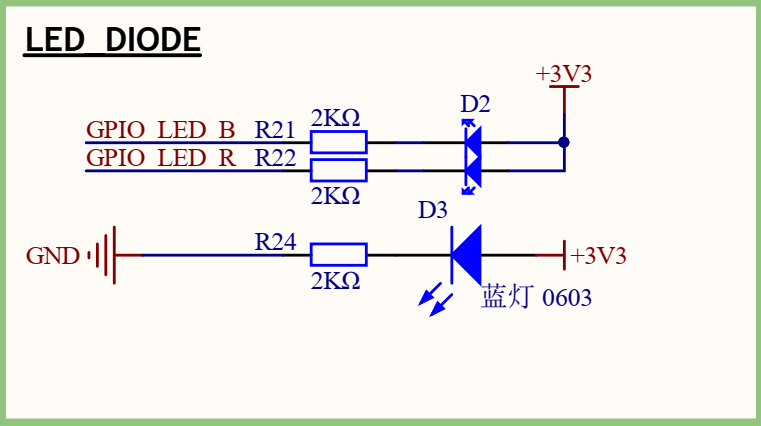

# LED blink routine

## Introduction

The main function of this routine is to make the blue LED in the onboard RGB-LED blink continuously.
This routine can also be used as a base project for your creation.

## Hardware description

As shown in the figure above, RGB-LED belongs to common anode LED, **cathode** are connected to the pins of the microcontroller respectively, and the blue LED corresponds to the PI8 pin. The MCU pin outputs a low level to light the LED, and outputs a high level to turn off the LED.

## Software Description

Blink's source code is located in `/projects/art_pi_blink_led/applications/main.c`. First define a macro `LED_PIN`, which represents the LED pin number of the flashing light, and then corresponds to `GPIO_LED_B` (**PI8**):

````
#define LED_PIN GET_PIN(I, 8)
````

In the main function, configure the pin to output mode, and in the while loop below, periodically (500ms) toggle the LED on and off.
```
int main(void)
{
    rt_uint32_t count = 1;

    rt_pin_mode(LED_PIN, PIN_MODE_OUTPUT);

    while(count++)
    {
        rt_thread_mdelay(500);
        rt_pin_write(LED_PIN, PIN_HIGH);
        rt_thread_mdelay(500);
        rt_pin_write(LED_PIN, PIN_LOW);
    }
    return RT_EOK;
}
```


## run
### Compile & Download

After compiling, connect the ST-Link USB port of the development board to the PC, and then download the firmware to the development board.

### running result

After normal operation, the blue LED will flash periodically.

## Precautions

If you want to modify the `LED_PIN` macro definition, you can modify it through GET_PIN.
