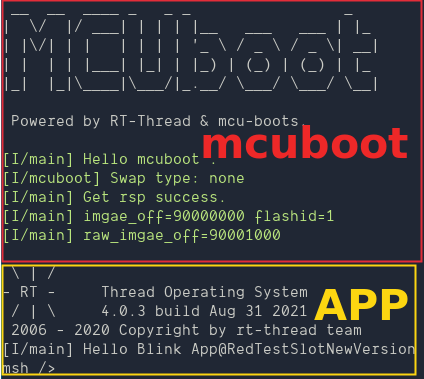

# BootLoader For MCUboot 例程
## Introduction

The main function of this routine is to add MCUboot support on the basis of the original ART-PI bootloader, to support parsing the image stored in the external 8MB Nor Flash on the ART-PI onboard and automatically boot the demo.

This demo relies on the **package mcuboot**, and uses the default configuration parameters to identify the Image stored at the start address of the onboard Nor Flash W25Q64. 

Note that this Image needs to meet two conditions:
1. The address of the program running cannot be 0x90000000, it is recommended to select the 0x90001000 position. Because the beginning part needs to be empty to store the image header.
2. The default configuration supports decryption, so you need to use the image_sign.pem private key in the mcuboot package for encryption. For specific encryption instructions, 
see [mcuboot package introduction](https://github.com/iysheng/rt_mcuboot/blob/ master/README.md)

## run
### Compile & Download

After compiling, connect the ST-Link USB port of the development board to the PC, and then download the firmware to the development board.

### running result

- After power-on, the bootloader program that supports mcuboot will be executed. After that, it will try to find whether there is a valid image at the onboard external flash 0 address. If there is a valid image and the decryption is passed, the image program of the image will be executed.

- When testing the update, you can use the command `do_mark_swap` to mark the update, and it will try to update the image from the secondary slot to the primary slot on the next reboot.

## Precautions

* If there is no valid image in the onboard flash, the MCU will end execution.
* The initial configuration of mcuboot package supports image size is 256KB.
