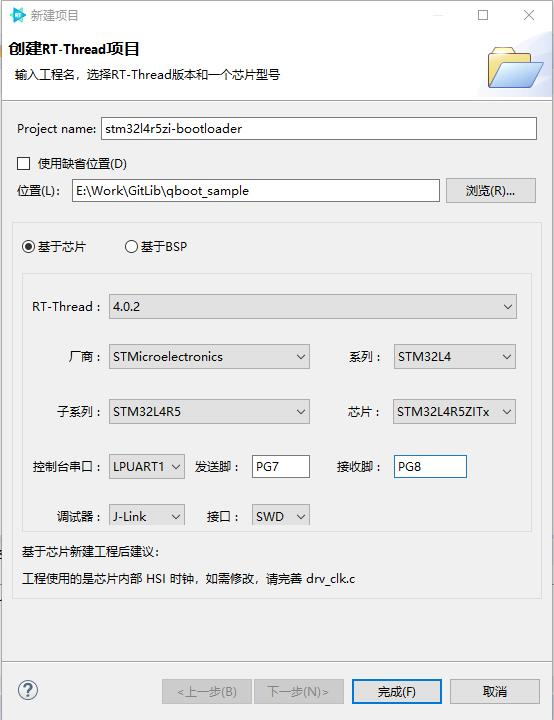
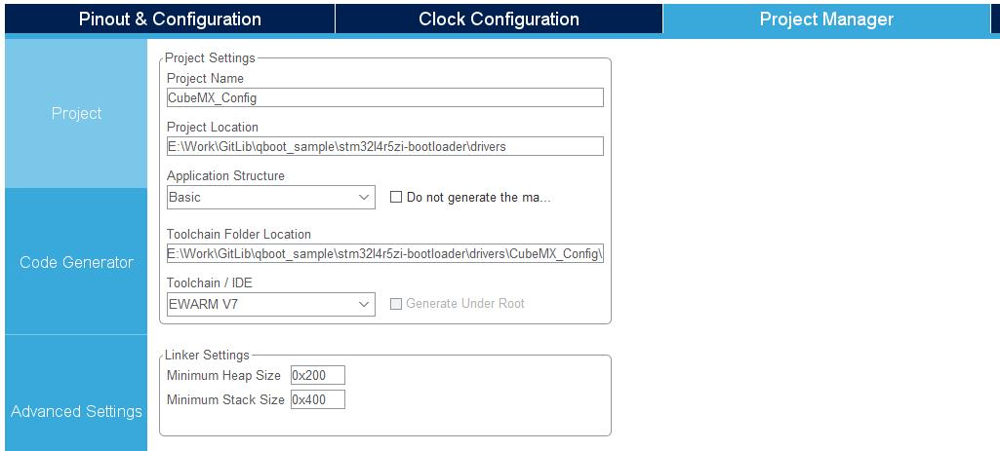
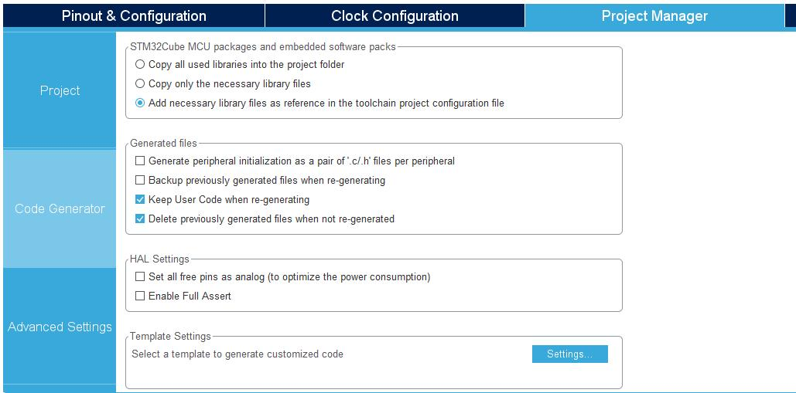
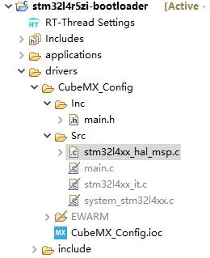
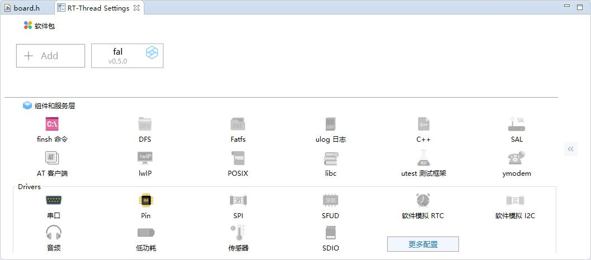
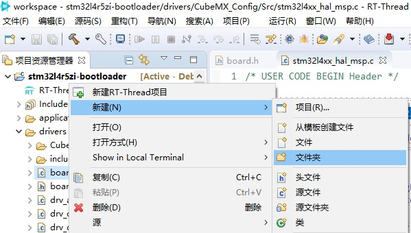
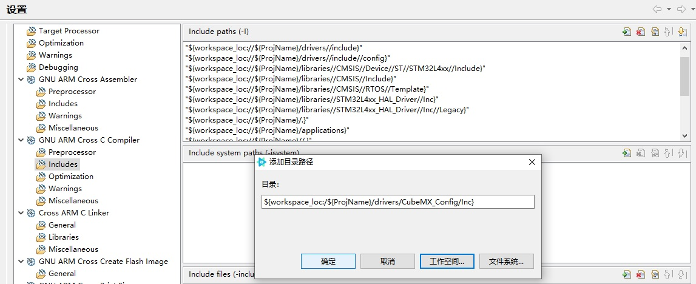
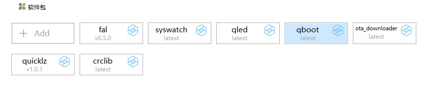
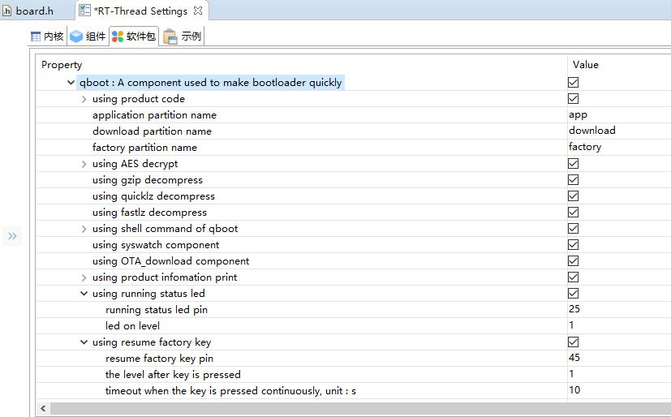
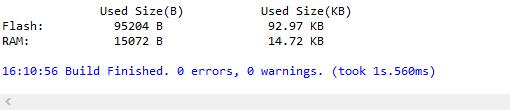

# QBoot usage guide - quickly build a bootloader based on RT-Thread 4.0

## 1. Introduction to QBoot components

#### The full name of the QBoot component is Quick bootloader, which is a special component used to quickly create a bootloader program. For the component description, please refer to [Component readme](https://gitee.com/qiyongzhong0/rt-thread-qboot/blob/master /readme.md). The original intention of this component is to help you speed up the development of bootloader programs. The components are designed based on RT-Thread 4.0 and rely on Fal and crclib components to work. The current version V1.00 only supports ARM series chips (the author has only tested it on STM32 series chips). The next version V1.10 will add support for more architecture chips. I hope you can provide help and support. Welcome to the QBoot component.

## 2. QBoot usage example

### 2.1 Create basic project

#### 2.1.1 Use RT-Thread Studio to create a project based on the chip (the chip model used in this example is STM32L4R5ZI)


#### 2.1.2 Modify board.h

##### Modify Flash and Ram size definitions:
````#define ROM_START  ((uint32_t)0x08000000)
#define ROM_SIZE   (2048)
#define ROM_END((uint32_t)(ROM_START + ROM_SIZE * 1024))

#define RAM_START  (0x20000000)
#define RAM_SIZE   (640)
#define RAM_END(RAM_START + RAM_SIZE * 1024)
```
##### 修改为
```
#define ROM_START              ((uint32_t)0x08000000)
#define ROM_SIZE               (2048 * 1024)
#define ROM_END                ((uint32_t)(ROM_START + ROM_SIZE))

#define RAM_START              (0x20000000)
#define RAM_SIZE               (640 * 1024)
#define RAM_END                (RAM_START + RAM_SIZE)
```

##### Add chip flash driver:
````
/*#define BSP_USING_ON_CHIP_FLASH*/
````
##### change into
````
#define BSP_USING_ON_CHIP_FLASH
````

##### If you use spi flash, you must add the spi driver. This example does not use it, so I won't repeat it here.

#### 2.1.3 Modify main.c, delete all the code in the main function, only keep `return RT_EOK;`
````
int main(void)
{
    return RT_EOK;
}
````

#### 2.1.4 Use CubeMX to generate the low-level initialization code of the chip and save it to the `driver` folder of the project
##### The project configuration is as follows:



##### The code generator is configured as follows:


##### Refresh the Studio project, exclude the `driver/CubeMX_Config/EWARM` directory from the build, and exclude other files in the `driver/CubeMX_Config/src` directory except `stm32l4xx_hal_msp.c` from the build , delete other files except `main.h` in the `driver/CubeMX_Config/inc` directory, as shown in the following figure:


#### 2.1.5 Add Fal component and save


#### 2.1.6 Create a folder `ports` under the project `driver`


#### 2.1.7 Add `fal_cfg.h` to the folder `ports`, the code is as follows:
```
#ifndef _FAL_CFG_H_
#define _FAL_CFG_H_

#include <rtconfig.h>
#include <board.h>

#define RT_APP_PART_ADDR            (0x08000000 + 128*1024)//app partition begin address

#define NOR_FLASH_DEV_NAME          FAL_USING_NOR_FLASH_DEV_NAME//"norflash0"

/* ===================== Flash device Configuration ========================= */
extern const struct fal_flash_dev stm32_onchip_flash;
//extern struct fal_flash_dev nor_flash0;

/* flash device table */
#define FAL_FLASH_DEV_TABLE                                          \
{                                                                    \
    &stm32_onchip_flash,                                             \
    /*&nor_flash0,*/                                                 \
}
/* ====================== Partition Configuration ========================== */
#ifdef FAL_PART_HAS_TABLE_CFG
/* partition table */
#define FAL_PART_TABLE                                                                      \
{                                                                                           \
    /*{FAL_PART_MAGIC_WORD,   "bl",           "onchip_flash",     0,          128*1024,  0},*/  \
    {FAL_PART_MAGIC_WORD,   "app",          "onchip_flash",     128*1024,   896*1024,  0},  \
    {FAL_PART_MAGIC_WORD,   "factory",      "onchip_flash",     1024*1024,  512*1024,  0},  \
    {FAL_PART_MAGIC_WORD,   "download",     "onchip_flash",     1536*1024,  512*1024,  0},  \
    /*{FAL_PART_MAGIC_WORD,   "filesys",      NOR_FLASH_DEV_NAME, 0,          8*1024*1024,  0},*/ \
}
#endif /* FAL_PART_HAS_TABLE_CFG */

#endif /* _FAL_CFG_H_ */
```
##### 注：使用不到的分区最好注释掉，可防止异常破坏数据。

#### 2.1.8 添加`drv_fal_init.c`到文件夹`ports`，代码如下：
```
#include <rtthread.h>

#ifdef PKG_USING_FAL

#include <fal.h>
extern int fal_init(void);
INIT_COMPONENT_EXPORT(fal_init);

#endif
```
#### 2.1.9 Open the build configuration, modify the `Optimization level` item on the `Optimization` page and configure it to `Optimize size (-Os)`, and add the directory `drivers/CubeMX_Config/Inc` to the `includes` of the compilation configuration and `drivers/ports`


#### 2.1.10 Refresh, save and compile the project, if there is no error, the basic project is created.

### 2.2 Add and configure QBoot components

#### 2.2.1 Add the QBoot component, select the system in the package center interface, add it in the QBoot component item, and finally close the package center


#### 2.2.2 Configure the QBoot component, in the `RT-Thread Settings` interface, double-click the qboot component, enter the option configuration interface


##### This example uses all the functions of the component, and modifies the three configuration items `running status led pin`, `resume factory key pin`, `the level after key is pressed`, and the others use the default configuration. You can modify other configuration items as needed. After the configuration is complete, save the project to complete the component update.


##### Compile the project, the code flash uses 92.97k, and the ram uses 14.72 to meet the design requirements


##### Note: In the case of using gzip, the version v1.0.0 of the zlib component uses more flash and less ram, while version last uses less flash and more ram, please choose to use according to different needs suitable version.

# >_< Congratulations! Your bootloader is done!

## 3. Help link:
- QBoot function modules need to be tailored for different requirements, please refer to [Resource Occupation of qboot Configurations](https://gitee.com/qiyongzhong0/rt-thread-qboot/blob/master/doc/QBoot%E5%90 %84%E9%A1%B9%E9%85%8D%E7%BD%AE%E8%B5%84%E6%BA%90%E5%8D%A0%E7%94%A8%E6%83%85 %E5%86%B5%E8%AF%B4%E6%98%8E.md)
- For the description of the flashing status of the running indicator, see [Operation Indicator Status Description](https://gitee.com/qiyongzhong0/rt-thread-qboot/blob/master/doc/QBoot%E7%8A%B6%E6% 80%81%E6%8C%87%E7%A4%BA%E7%81%AF%E8%AF%B4%E6%98%8E.md)
- Upgrade package packaging tool [download link](https://gitee.com/qiyongzhong0/rt-thread-qboot/blob/master/tools/QBootPackager_V1.00.zip)
- For the description of the related commands of the shell command line QBoot, see [QBoot Command Details](https://gitee.com/qiyongzhong0/rt-thread-qboot/blob/master/doc/QBoot%E5%91%BD%E4 %BB%A4%E8%AF%A6%E8%BF%B0.md)

## 4. Contact Information

- Maintenance: qiyongzhong
- Homepage: https://gitee.com/qiyongzhong0/rt-thread-qboot
- Email: 917768104@qq.com